# Sơ đồ luồng fabframe

Trang này gom 30 sơ đồ giải thích fabframe chạy thế nào: bấm ▶ **Chạy** (hay gõ lệnh) thì ai gọi ai,
kernel xếp sự kiện ra sao, dispatcher được hỏi lúc nào và điểm của nó đi đâu, KPI đếm từ đâu, và nhà
máy 3D lấy trạng thái máy từ đâu. Mọi sơ đồ vẽ theo mã nguồn hiện tại và đã được đối chiếu lại với mã;
cuối mỗi mục có link tới đúng dòng. GitHub tự vẽ các sơ đồ Mermaid, cả nền sáng lẫn nền tối.

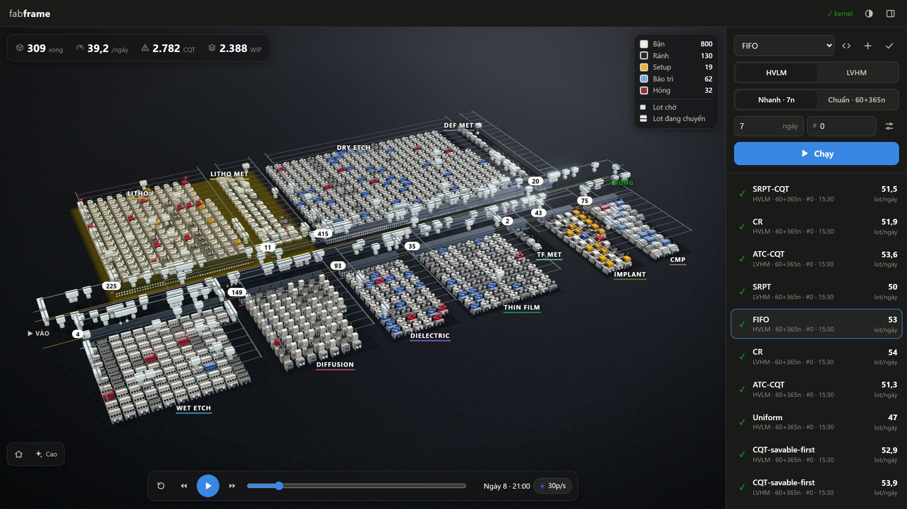

## Mục lục

| Phần | Sơ đồ |
|---|---|
| [A — Tổng quan và cách dùng](#phần-a--tổng-quan-và-cách-dùng) | [A1 Bức tranh tổng thể](#a1-bức-tranh-tổng-thể) · [A2 Ba cách chạy](#a2-ba-cách-chạy) · [A3 Nạp dispatcher (loader.py)](#a3-nạp-dispatcher-loaderpy) · [A4 Lệnh dòng lệnh](#a4-lệnh-dòng-lệnh) · [A5 Viết một dispatcher mới](#a5-viết-một-dispatcher-mới) · [A6 Bộ test bảo vệ điều gì](#a6-bộ-test-bảo-vệ-điều-gì) |
| [B — Bên trong kernel PySCFabSim](#phần-b--bên-trong-kernel-pyscfabsim) | [B1 Nạp kernel và kiểm toàn vẹn](#b1-nạp-kernel-và-kiểm-toàn-vẹn) · [B2 Dựng nhà máy từ dữ liệu SMT2020](#b2-dựng-nhà-máy-từ-dữ-liệu-smt2020) · [B3 Vòng lặp sự kiện (lot-for-machine)](#b3-vòng-lặp-sự-kiện-lot-for-machine) · [B4 Kernel áp dụng một dispatch](#b4-kernel-áp-dụng-một-dispatch) · [B5 Trạng thái một máy](#b5-trạng-thái-một-máy) · [B6 Vòng đời một lot](#b6-vòng-đời-một-lot) |
| [C — Một quyết định dispatch](#phần-c--một-quyết-định-dispatch) | [C1 runner.run() từ đầu đến cuối](#c1-runnerrun-từ-đầu-đến-cuối) · [C2 Một quyết định](#c2-một-quyết-định) · [C3 Thứ tự cuối cùng và bộ chọn của kernel](#c3-thứ-tự-cuối-cùng-và-bộ-chọn-của-kernel) · [C4 Bảo vệ và FIFO dự phòng](#c4-bảo-vệ-và-fifo-dự-phòng) · [C5 Tám luật Paper 4](#c5-tám-luật-paper-4) · [C6 RNG theo sự kiện](#c6-rng-theo-sự-kiện) · [C7 Warm-up, cửa sổ đo và KPI](#c7-warm-up-cửa-sổ-đo-và-kpi) |
| [D — Giao diện web và replay 3D](#phần-d--giao-diện-web-và-replay-3d) | [D1 Vòng đời một lần chạy trên web](#d1-vòng-đời-một-lần-chạy-trên-web) · [D2 Trạng thái một lần chạy](#d2-trạng-thái-một-lần-chạy) · [D3 Lớp bảo vệ của server](#d3-lớp-bảo-vệ-của-server) · [D4 Ghi replay (ReplayRecorder)](#d4-ghi-replay-replayrecorder) · [D5 Từ replay tới hình 3D (fab3d.js)](#d5-từ-replay-tới-hình-3d-fab3djs) · [D6 Tua và phát](#d6-tua-và-phát) |
| [Bản draw.io](#bản-drawio-chỉnh-sửa-được) | Tổng quan hệ thống · Một quyết định dispatch |

## Phần A — Tổng quan và cách dùng

Phần này cho thấy các khối của fabframe gọi nhau ra sao, ba cách chạy một mô phỏng và file mỗi
cách để lại, khung nạp dispatcher thế nào và các lệnh dòng lệnh. Hai sơ đồ cuối dành cho người
viết dispatcher: quy trình viết – kiểm – chạy, và những gì bộ test đang bảo vệ.

### A1. Bức tranh tổng thể

Bấm ▶ Chạy, gõ lệnh hay gọi `run()` từ Python thì ai gọi ai, và kết quả nằm ở đâu? Cả ba đường
đều đến `runner.run()`. Giao diện web không mô phỏng trong tiến trình của nó (nó chỉ nạp kernel
để đọc bố trí nhà máy cho cảnh 3D và kiểm MANIFEST): mỗi lần chạy hay kiểm tra là một tiến
trình con `python -m fabframe`.

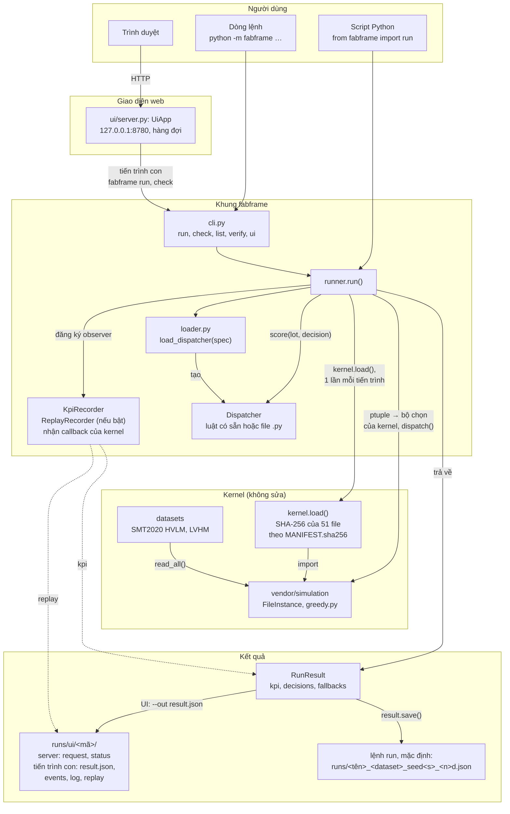
```mermaid
flowchart TD
    subgraph NGUOI["Người dùng"]
        U1["Trình duyệt"]
        U2["Dòng lệnh<br/>python -m fabframe …"]
        U3["Script Python<br/>from fabframe import run"]
    end
    subgraph WEB["Giao diện web"]
        W1["ui/server.py: UiApp<br/>127.0.0.1:8780, hàng đợi"]
    end
    subgraph KHUNG["Khung fabframe"]
        C1["cli.py<br/>run, check, list, verify, ui"]
        R1["runner.run()"]
        P1["KpiRecorder<br/>ReplayRecorder (nếu bật)<br/>nhận callback của kernel"]
        L1["loader.py<br/>load_dispatcher(spec)"]
        D1["Dispatcher<br/>luật có sẵn hoặc file .py"]
    end
    subgraph KERNEL["Kernel (không sửa)"]
        K3["datasets<br/>SMT2020 HVLM, LVHM"]
        K1["kernel.load()<br/>SHA-256 của 51 file<br/>theo MANIFEST.sha256"]
        K2["vendor/simulation<br/>FileInstance, greedy.py"]
    end
    subgraph KQ["Kết quả"]
        O3["RunResult<br/>kpi, decisions, fallbacks"]
        O1["runs/ui/#lt;mã#gt;/<br/>server: request, status<br/>tiến trình con: result.json,<br/>events, log, replay"]
        O2["lệnh run, mặc định:<br/>runs/#lt;tên#gt;_#lt;dataset#gt;_seed#lt;s#gt;_#lt;n#gt;d.json"]
    end
    U1 -->|HTTP| W1
    W1 -->|"tiến trình con<br/>fabframe run, check"| C1
    U2 --> C1
    C1 --> R1
    U3 --> R1
    R1 -->|"đăng ký observer"| P1
    R1 --> L1
    L1 -->|tạo| D1
    R1 -->|"score(lot, decision)"| D1
    R1 -->|"kernel.load(),<br/>1 lần mỗi tiến trình"| K1
    K1 -->|import| K2
    K3 -->|"read_all()"| K2
    R1 -->|"ptuple → bộ chọn<br/>của kernel, dispatch()"| K2
    D1 ~~~ K3
    D1 ~~~ K1
    P1 ~~~ K1
    K2 ~~~ O3
    P1 -.->|replay| O1
    R1 -->|trả về| O3
    P1 -.->|kpi| O3
    O3 -->|"UI: --out result.json"| O1
    O3 -->|"result.save()"| O2
```

**Điểm cần biết:**
- Khung chỉ thay khoá sắp xếp của từng lot (`ptuple`). Ghép batch (chỉ dispatch batch đủ
  `batch_max`), chuyển việc sang máy cùng họ đã có đúng setup và chốt minimum-run (nhả sau 5 lần
  hoãn) vẫn do bộ chọn `get_lots_to_dispatch_by_machine()` của kernel làm.
- Warm-up luôn chạy FIFO có sẵn. `KpiRecorder` chỉ đếm sự kiện trong cửa sổ
  [warm-up, warm-up + days] × 86400 s, tính cả hai đầu.
- `kernel.load()` dừng với `KernelError` nếu một file lệch `MANIFEST.sha256`, có file `.py` lạ
  trong `vendor/`, hoặc một gói `simulation` khác đã được import trước.
- Kernel có tính thời gian vận chuyển: lot xong một bước sau setup (nếu có), gia công, nạp/dỡ
  và, nếu còn bước sau, một trễ Fab→Fab rút từ `fromto.txt` (đều trong 375–525 s). Không có xe
  hay giới hạn AMHS; xe OHT trong cảnh 3D chỉ là minh hoạ.

Mã nguồn: [runner.py#L172-L329](../fabframe/runner.py#L172-L329),
[cli.py#L56-L69](../fabframe/cli.py#L56-L69),
[ui/server.py#L282-L302](../fabframe/ui/server.py#L282-L302),
[ui/server.py#L387-L397](../fabframe/ui/server.py#L387-L397),
[kernel/\_\_init\_\_.py#L47-L113](../fabframe/kernel/__init__.py#L47-L113),
[loader.py#L33-L62](../fabframe/loader.py#L33-L62),
[kpi.py#L38-L160](../fabframe/kpi.py#L38-L160),
[replay.py#L98-L381](../fabframe/replay.py#L98-L381),
[greedy.py#L25-L90](../fabframe/kernel/vendor/simulation/greedy.py#L25-L90),
[instance.py#L287-L288](../fabframe/kernel/vendor/simulation/instance.py#L287-L288),
[instance.py#L320-L333](../fabframe/kernel/vendor/simulation/instance.py#L320-L333)

### A2. Ba cách chạy

Ba cách cùng gọi `runner.run()` nhưng để lại file khác nhau: Python chỉ trả về một đối tượng,
dòng lệnh thêm file kết quả, giao diện web thêm hàng đợi và một thư mục cho mỗi lần chạy.

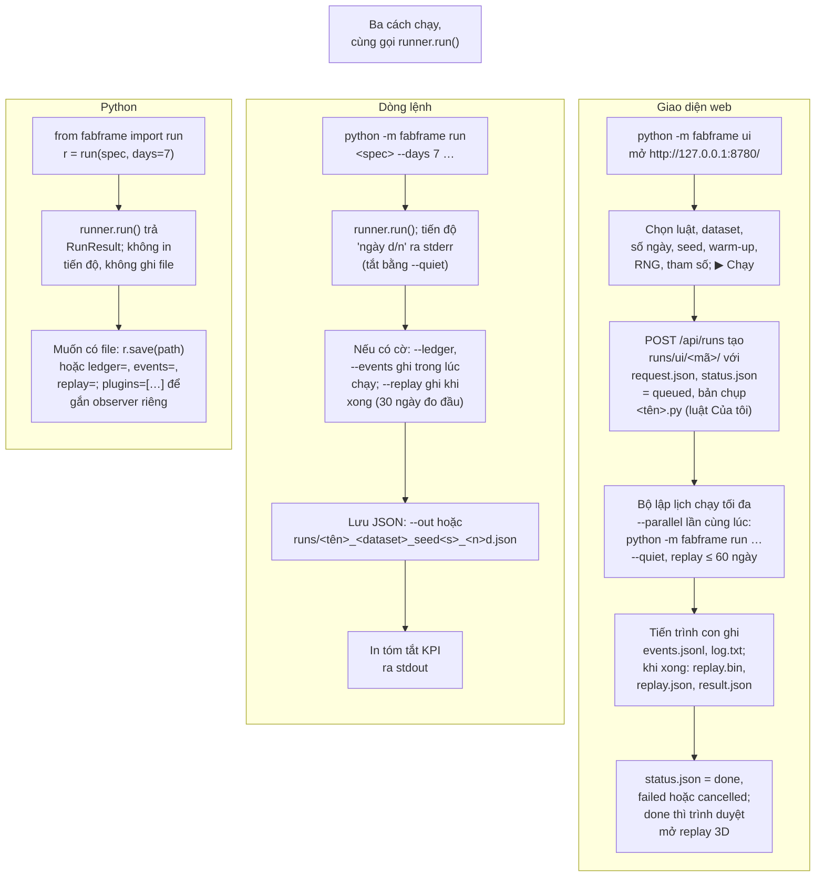
```mermaid
flowchart TD
    S["Ba cách chạy,<br/>cùng gọi runner.run()"]
    subgraph WEB["Giao diện web"]
        W1["python -m fabframe ui<br/>mở http://127.0.0.1:8780/"]
        W2["Chọn luật, dataset,<br/>số ngày, seed, warm-up,<br/>RNG, tham số; ▶ Chạy"]
        W3["POST /api/runs tạo<br/>runs/ui/#lt;mã#gt;/ với<br/>request.json, status.json<br/>= queued, bản chụp<br/>#lt;tên#gt;.py (luật Của tôi)"]
        W4["Bộ lập lịch chạy tối đa<br/>--parallel lần cùng lúc:<br/>python -m fabframe run …<br/>--quiet, replay ≤ 60 ngày"]
        W5["Tiến trình con ghi<br/>events.jsonl, log.txt;<br/>khi xong: replay.bin,<br/>replay.json, result.json"]
        W6["status.json = done,<br/>failed hoặc cancelled;<br/>done thì trình duyệt<br/>mở replay 3D"]
        W1 --> W2 --> W3 --> W4 --> W5 --> W6
    end
    subgraph CLI["Dòng lệnh"]
        C1["python -m fabframe run<br/>#lt;spec#gt; --days 7 …"]
        C2["runner.run(); tiến độ<br/>'ngày d/n' ra stderr<br/>(tắt bằng --quiet)"]
        C3["Nếu có cờ: --ledger,<br/>--events ghi trong lúc<br/>chạy; --replay ghi khi<br/>xong (30 ngày đo đầu)"]
        C4["Lưu JSON: --out hoặc<br/>runs/#lt;tên#gt;_#lt;dataset#gt;_seed#lt;s#gt;_#lt;n#gt;d.json"]
        C5["In tóm tắt KPI<br/>ra stdout"]
        C1 --> C2 --> C3 --> C4 --> C5
    end
    subgraph PY["Python"]
        P1["from fabframe import run<br/>r = run(spec, days=7)"]
        P2["runner.run() trả<br/>RunResult; không in<br/>tiến độ, không ghi file"]
        P3["Muốn có file: r.save(path)<br/>hoặc ledger=, events=,<br/>replay=; plugins=[…] để<br/>gắn observer riêng"]
        P1 --> P2 --> P3
    end
    S ~~~ W1
    S ~~~ C1
    S ~~~ P1
```

**Điểm cần biết:**
- Replay chỉ được ghi khi lần chạy kết thúc: lần chạy bị giết giữa chừng không có replay. Hàng
  đợi chỉ nằm trong bộ nhớ server; sau khi server tắt, lần chạy còn ghi `running` hay `queued`
  trong `status.json` được API báo là `interrupted` và không chạy tiếp được.
- Bản `replay.*.gz` do server tạo khi có GET đầu tiên (file trên 32 KiB, trình duyệt nhận gzip);
  file gốc vẫn giữ.
- Giao diện ghi replay tối đa 60 ngày đo đầu; dòng lệnh `--replay-days` mặc định 30.
- Tên file `--out` mặc định chỉ gồm tên luật, dataset, seed và số ngày: hai lần chạy chỉ khác
  warm-up, RNG hay `-o` (trừ khi tên luật mang tham số, như `ATC (k=3)`) sẽ ghi đè nhau.

Mã nguồn: [ui/server.py#L240-L326](../fabframe/ui/server.py#L240-L326),
[ui/server.py#L328-L332](../fabframe/ui/server.py#L328-L332),
[ui/server.py#L405-L428](../fabframe/ui/server.py#L405-L428),
[ui/server.py#L599-L605](../fabframe/ui/server.py#L599-L605),
[app.js#L527-L545](../fabframe/ui/static/app.js#L527-L545),
[cli.py#L27-L29](../fabframe/cli.py#L27-L29),
[cli.py#L56-L69](../fabframe/cli.py#L56-L69),
[runner.py#L234-L303](../fabframe/runner.py#L234-L303)

### A3. Nạp dispatcher (loader.py)

Chuỗi `fifo`, `rule.py`, `rule.py:Ten` hay `goi.module:Ten` thành một đối tượng `Dispatcher`
thế nào, và tham số `-o` đi vào đâu?

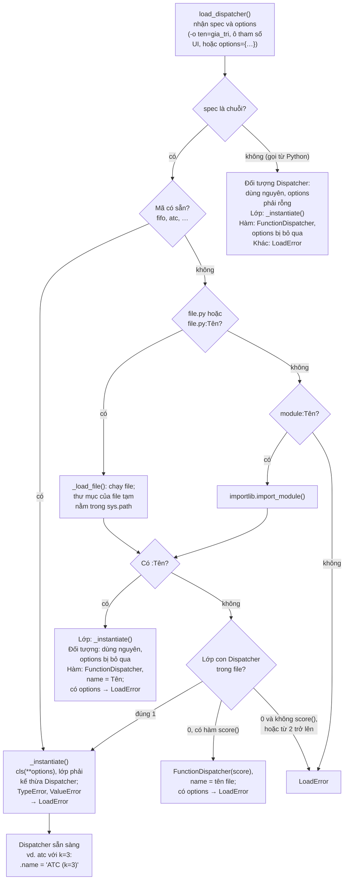
```mermaid
flowchart TD
    O["load_dispatcher()<br/>nhận spec và options<br/>(-o ten=gia_tri, ô tham số<br/>UI, hoặc options={…})"]
    A{"spec là chuỗi?"}
    PY["Đối tượng Dispatcher:<br/>dùng nguyên, options<br/>phải rỗng<br/>Lớp: _instantiate()<br/>Hàm: FunctionDispatcher,<br/>options bị bỏ qua<br/>Khác: LoadError"]
    C{"Mã có sẵn?<br/>fifo, atc, …"}
    D{"file.py hoặc<br/>file.py:Tên?"}
    D1["_load_file(): chạy file;<br/>thư mục của file tạm<br/>nằm trong sys.path"]
    E{"module:Tên?"}
    E1["importlib.import_module()"]
    P{"Có :Tên?"}
    PT["Lớp: _instantiate()<br/>Đối tượng: dùng nguyên,<br/>options bị bỏ qua<br/>Hàm: FunctionDispatcher,<br/>name = Tên;<br/>có options → LoadError"]
    Q{"Lớp con Dispatcher<br/>trong file?"}
    Q1["FunctionDispatcher(score),<br/>name = tên file;<br/>có options → LoadError"]
    X["LoadError"]
    I["_instantiate()<br/>cls(**options), lớp phải<br/>kế thừa Dispatcher;<br/>TypeError, ValueError<br/>→ LoadError"]
    N["Dispatcher sẵn sàng<br/>vd. atc với k=3:<br/>.name = 'ATC (k=3)'"]
    O --> A
    A -->|có| C
    A -->|"không (gọi từ Python)"| PY
    C -->|có| I
    C -->|không| D
    D -->|có| D1 --> P
    D -->|không| E
    E -->|có| E1 --> P
    E -->|không| X
    P -->|có| PT
    P -->|không| Q
    Q -->|"đúng 1"| I
    Q -->|"0, có hàm score()"| Q1
    Q -->|"0 và không score(),<br/>hoặc từ 2 trở lên"| X
    I --> N
```

**Điểm cần biết:**
- Mã có sẵn phân biệt hoa thường: `FIFO` báo `LoadError`, phải gõ `fifo` (xem `fabframe list`).
- `-o` tách ở dấu `=` đầu tiên, tên phải là định danh Python, giá trị qua `ast.literal_eval`
  (`3` → int, `0.5` → float, `True` → bool); không đọc được thì giữ nguyên chuỗi. Ô tham số
  của UI chỉ nhận số và `true`/`false` (chữ thường), còn lại là chuỗi (gõ `True` thành `'True'`);
  server gửi tiếp `-o ten=repr(giá trị)`.
- Lỗi khi nạp, kể cả lỗi trong code cấp module và hàm khởi tạo, dừng lần chạy trước khi mô
  phỏng bắt đầu. FIFO dự phòng chỉ áp cho `score()`.
- `.name` đi vào `RunResult.dispatcher`, replay và tên file `--out` mặc định (`ATC (k=3)` →
  `runs/ATC_k_3__HVLM_seed0_7d.json`). Bản thân `options` không có trong `result.json`; giao
  diện web chỉ lưu chúng ở `request.json`.

Mã nguồn: [loader.py#L33-L122](../fabframe/loader.py#L33-L122),
[cli.py#L14-L24](../fabframe/cli.py#L14-L24),
[app.js#L480-L494](../fabframe/ui/static/app.js#L480-L494),
[ui/server.py#L293-L294](../fabframe/ui/server.py#L293-L294),
[classic.py#L63-L70](../fabframe/dispatchers/classic.py#L63-L70),
[api.py#L100-L108](../fabframe/api.py#L100-L108)

### A4. Lệnh dòng lệnh

Năm lệnh con của `python -m fabframe`, cờ chính và thứ mỗi lệnh in ra hoặc ghi ra. Số ghi sau
cờ là giá trị mặc định; với cờ có lựa chọn, giá trị đứng đầu là mặc định.

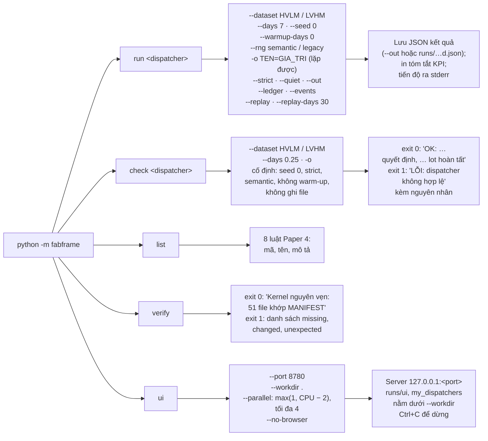
```mermaid
flowchart LR
    M["python -m fabframe"]
    RUN["run #lt;dispatcher#gt;"]
    CHK["check #lt;dispatcher#gt;"]
    LST["list"]
    VER["verify"]
    UI["ui"]
    RF["--dataset HVLM / LVHM<br/>--days 7 · --seed 0<br/>--warmup-days 0<br/>--rng semantic / legacy<br/>-o TEN=GIA_TRI (lặp được)<br/>--strict · --quiet · --out<br/>--ledger · --events<br/>--replay · --replay-days 30"]
    RO["Lưu JSON kết quả<br/>(--out hoặc runs/…d.json);<br/>in tóm tắt KPI;<br/>tiến độ ra stderr"]
    CF["--dataset HVLM / LVHM<br/>--days 0.25 · -o<br/>cố định: seed 0, strict,<br/>semantic, không warm-up,<br/>không ghi file"]
    CO["exit 0: 'OK: …<br/>quyết định, … lot hoàn tất'<br/>exit 1: 'LỖI: dispatcher<br/>không hợp lệ'<br/>kèm nguyên nhân"]
    LO["8 luật Paper 4:<br/>mã, tên, mô tả"]
    VO["exit 0: 'Kernel nguyên vẹn:<br/>51 file khớp MANIFEST'<br/>exit 1: danh sách missing,<br/>changed, unexpected"]
    UF["--port 8780<br/>--workdir .<br/>--parallel: max(1, CPU − 2),<br/>tối đa 4<br/>--no-browser"]
    UO["Server 127.0.0.1:#lt;port#gt;<br/>runs/ui, my_dispatchers<br/>nằm dưới --workdir<br/>Ctrl+C để dừng"]
    M --> RUN --> RF --> RO
    M --> CHK --> CF --> CO
    M --> LST --> LO
    M --> VER --> VO
    M --> UI --> UF --> UO
```

**Điểm cần biết:**
- `check` chỉ in `LỖI: dispatcher không hợp lệ` cho lỗi trong `score()` hoặc điểm sai
  (`DispatcherError`). Lỗi khi nạp file, trong hàm khởi tạo hay `setup()` hiện traceback, cũng
  exit 1.
- Đường dẫn `--out` mặc định tính từ thư mục hiện tại.
- `ui` thử tiếp 8781…8789 khi không mở được cổng. Trên Windows, UI thứ hai vẫn mở được đúng cổng
  của UI đang chạy (SO_REUSEADDR) và bị UI cũ che: tắt UI cũ trước.
- Theo README, gói không được cài vào `.venv`: chạy `python -m fabframe` từ thư mục gốc dự án,
  hoặc đặt `PYTHONPATH`.

Mã nguồn: [cli.py#L36-L69](../fabframe/cli.py#L36-L69),
[cli.py#L72-L167](../fabframe/cli.py#L72-L167),
[ui/server.py#L136-L143](../fabframe/ui/server.py#L136-L143),
[ui/server.py#L653-L688](../fabframe/ui/server.py#L653-L688)

### A5. Viết một dispatcher mới

Quy trình viết, kiểm tra, chạy và sửa một luật, cùng nơi file nằm sau mỗi bước.

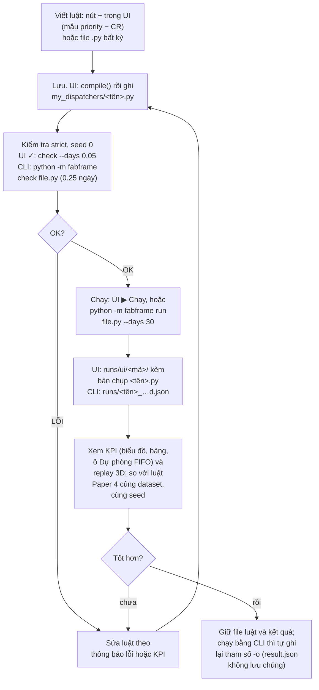
```mermaid
flowchart TD
    S1["Viết luật: nút + trong UI<br/>(mẫu priority − CR)<br/>hoặc file .py bất kỳ"]
    S2["Lưu. UI: compile() rồi ghi<br/>my_dispatchers/#lt;tên#gt;.py"]
    S3["Kiểm tra strict, seed 0<br/>UI ✓: check --days 0.05<br/>CLI: python -m fabframe<br/>check file.py (0.25 ngày)"]
    S3D{"OK?"}
    S4["Sửa luật theo<br/>thông báo lỗi hoặc KPI"]
    S5["Chạy: UI ▶ Chạy, hoặc<br/>python -m fabframe run<br/>file.py --days 30"]
    S6["UI: runs/ui/#lt;mã#gt;/ kèm<br/>bản chụp #lt;tên#gt;.py<br/>CLI: runs/#lt;tên#gt;_…d.json"]
    S7["Xem KPI (biểu đồ, bảng,<br/>ô Dự phòng FIFO) và<br/>replay 3D; so với luật<br/>Paper 4 cùng dataset,<br/>cùng seed"]
    S8{"Tốt hơn?"}
    S9["Giữ file luật và kết quả;<br/>chạy bằng CLI thì tự ghi<br/>lại tham số -o (result.json<br/>không lưu chúng)"]
    S1 --> S2 --> S3 --> S3D
    S3D -->|LỖI| S4 --> S2
    S3D -->|OK| S5 --> S6 --> S7 --> S8
    S8 -->|chưa| S4
    S8 -->|rồi| S9
```

<table>
<tr>
<td width="50%">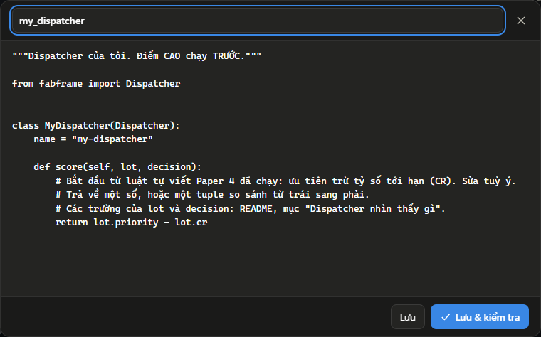</td>
<td width="50%">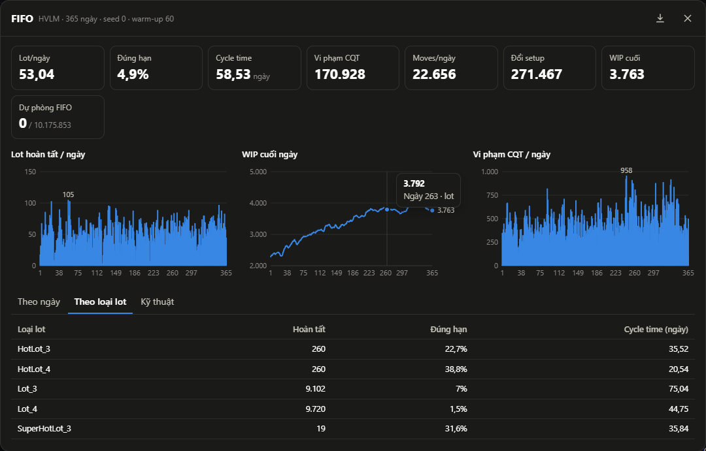</td>
</tr>
<tr>
<td align="center">Viết luật ngay trong giao diện (nút <b>+</b> bắt đầu từ luật priority − CR)</td>
<td align="center">Xem KPI của một lần chạy (biểu tượng 📊 trong danh sách)</td>
</tr>
</table>

**Điểm cần biết:**
- Nút ✓ và "Lưu & kiểm tra" luôn chạy `check --days 0.05` trên HVLM, seed 0, không truyền ô
  tham số: luật bắt buộc có tham số sẽ báo lỗi dù chạy được.
- Lần chạy trong UI dùng bản chụp một file trong `runs/ui/<mã>/`. Module phụ đặt cạnh file
  trong `my_dispatchers/` không được chép theo, nên kiểm tra qua mà lần chạy lỗi
  `ModuleNotFoundError`.
- Khi chạy thường, lỗi trong `score()` hay điểm sai chỉ làm quyết định đó dùng FIFO và được đếm
  (`fallbacks`, ô "Dự phòng FIFO"). Lỗi trong hàm khởi tạo hay `setup()` dừng cả lần chạy.
- Điểm phải là `int`/`float` hữu hạn (không `bool`, không NaN), hoặc tuple các số cùng độ dài
  trong một quyết định.

Mã nguồn: [ui/server.py#L68-L81](../fabframe/ui/server.py#L68-L81),
[ui/server.py#L196-L225](../fabframe/ui/server.py#L196-L225),
[ui/server.py#L267-L269](../fabframe/ui/server.py#L267-L269),
[app.js#L672-L699](../fabframe/ui/static/app.js#L672-L699),
[app.js#L738-L742](../fabframe/ui/static/app.js#L738-L742),
[cli.py#L72-L86](../fabframe/cli.py#L72-L86),
[runner.py#L77-L101](../fabframe/runner.py#L77-L101),
[runner.py#L146-L156](../fabframe/runner.py#L146-L156),
[runner.py#L227-L230](../fabframe/runner.py#L227-L230)

### A6. Bộ test bảo vệ điều gì

Mỗi file test chứng minh điều gì, và chỗ nào chưa có test. Bộ đầy đủ có 75 test
(`python -m pytest`, khoảng 2 phút).

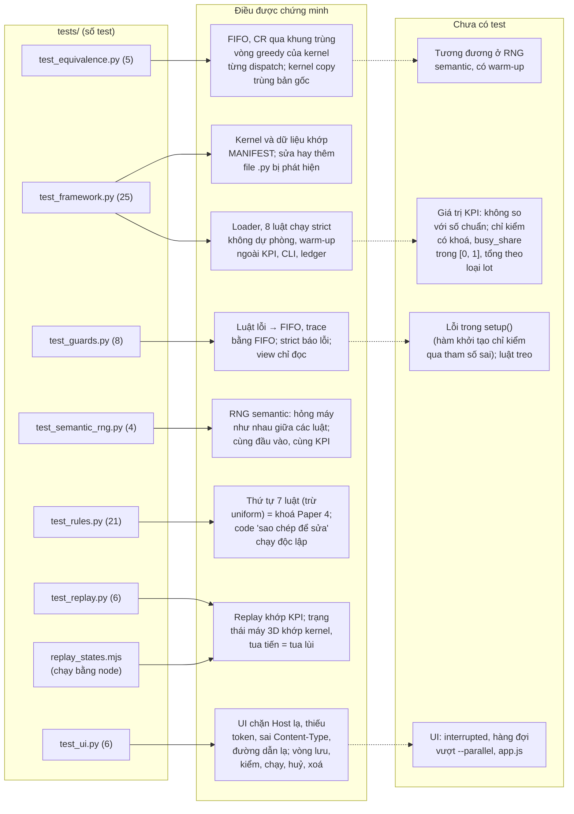
```mermaid
flowchart LR
    subgraph TEST["tests/ (số test)"]
        T1["test_equivalence.py (5)"]
        T2["test_framework.py (25)"]
        T3["test_guards.py (8)"]
        T4["test_semantic_rng.py (4)"]
        T5["test_rules.py (21)"]
        T6["test_replay.py (6)"]
        T7["replay_states.mjs<br/>(chạy bằng node)"]
        T8["test_ui.py (6)"]
    end
    subgraph DAMBAO["Điều được chứng minh"]
        G1["FIFO, CR qua khung trùng<br/>vòng greedy của kernel<br/>từng dispatch; kernel copy<br/>trùng bản gốc"]
        G2["Kernel và dữ liệu khớp<br/>MANIFEST; sửa hay thêm<br/>file .py bị phát hiện"]
        G3["Loader, 8 luật chạy strict<br/>không dự phòng, warm-up<br/>ngoài KPI, CLI, ledger"]
        G4["Luật lỗi → FIFO, trace<br/>bằng FIFO; strict báo lỗi;<br/>view chỉ đọc"]
        G5["RNG semantic: hỏng máy<br/>như nhau giữa các luật;<br/>cùng đầu vào, cùng KPI"]
        G6["Thứ tự 7 luật (trừ<br/>uniform) = khoá Paper 4;<br/>code 'sao chép để sửa'<br/>chạy độc lập"]
        G7["Replay khớp KPI; trạng<br/>thái máy 3D khớp kernel,<br/>tua tiến = tua lùi"]
        G8["UI chặn Host lạ, thiếu<br/>token, sai Content-Type,<br/>đường dẫn lạ; vòng lưu,<br/>kiểm, chạy, huỷ, xoá"]
    end
    subgraph CHUA["Chưa có test"]
        N3["Tương đương ở RNG<br/>semantic, có warm-up"]
        N1["Giá trị KPI: không so<br/>với số chuẩn; chỉ kiểm<br/>có khoá, busy_share<br/>trong [0, 1], tổng theo<br/>loại lot"]
        N2["Lỗi trong setup()<br/>(hàm khởi tạo chỉ kiểm<br/>qua tham số sai); luật treo"]
        N4["UI: interrupted, hàng đợi<br/>vượt --parallel, app.js"]
    end
    T1 --> G1
    T2 --> G2
    T2 --> G3
    T3 --> G4
    T4 --> G5
    T5 --> G6
    T6 --> G7
    T7 --> G7
    T8 --> G8
    G1 -.-> N3
    G3 -.-> N1
    G4 -.-> N2
    G8 -.-> N4
```

**Điểm cần biết:**
- Ba test cần `node` trong PATH; một test cần cây PySCFabSim gốc ở một đường dẫn `D:\` cố định.
  Thiếu thì pytest bỏ qua (skip) chứ không báo lỗi.
- Tương đương với kernel chỉ được chứng minh ở RNG `legacy`, seed 3, HVLM 2 ngày và LVHM 1
  ngày, không warm-up.
- `test_rules.py` thêm khoá phụ `lot.id` mà runner không có, và chỉ dùng lot đơn: thứ tự giữa
  các nhóm batch không được so với Paper 4.
- So khớp 3D chỉ dùng 3 trạng thái (rảnh; bận, gồm cả PM theo số wafer; dừng do hỏng hay PM
  theo lịch) và cho lệch tối đa 0,1%.

Mã nguồn: [test_equivalence.py#L19-L80](../tests/test_equivalence.py#L19-L80),
[test_framework.py#L19-L143](../tests/test_framework.py#L19-L143),
[test_guards.py#L55-L104](../tests/test_guards.py#L55-L104),
[test_semantic_rng.py#L9-L42](../tests/test_semantic_rng.py#L9-L42),
[test_rules.py#L52-L208](../tests/test_rules.py#L52-L208),
[test_replay.py#L65-L148](../tests/test_replay.py#L65-L148),
[replay_states.mjs#L32-L64](../tests/replay_states.mjs#L32-L64),
[test_ui.py#L58-L178](../tests/test_ui.py#L58-L178)

## Phần B — Bên trong kernel PySCFabSim

Kernel là bản copy đã ghim của PySCFabSim-release trong `fabframe/kernel/vendor/simulation`;
fabframe gọi nó chứ không sửa mã của nó. Sáu sơ đồ dưới đây đi từ lúc nạp kernel tới từng sự kiện;
thời gian tính bằng giây kể từ t = 0, số liệu ví dụ là của HVLM.

### B1. Nạp kernel và kiểm toàn vẹn

`kernel.load()` kiểm gì trước khi cho mô phỏng chạy, và chuyện gì xảy ra khi một byte của kernel
hay dữ liệu bị đổi?

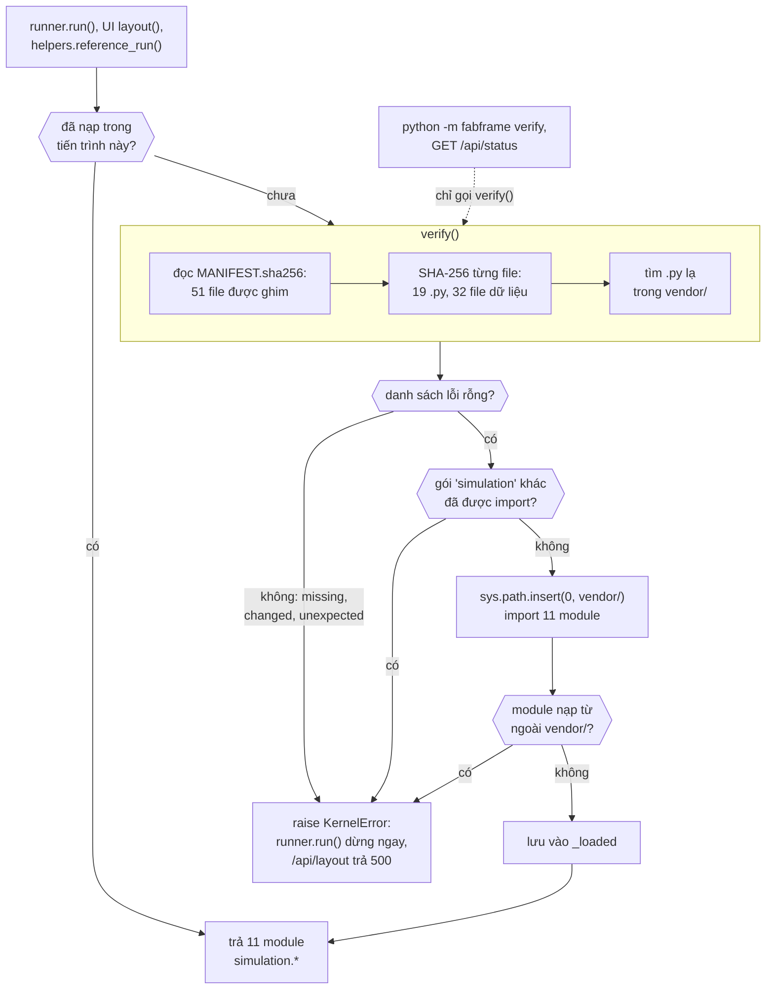
```mermaid
flowchart TD
    CALL["runner.run(), UI layout(),<br/>helpers.reference_run()"] --> CACHE{{"đã nạp trong<br/>tiến trình này?"}}
    CLI["python -m fabframe verify,<br/>GET /api/status"] -.->|"chỉ gọi verify()"| VERIFY
    CACHE -- "có" --> RET["trả 11 module<br/>simulation.*"]
    CACHE -- "chưa" --> VERIFY
    subgraph VERIFY["verify()"]
        direction LR
        V1["đọc MANIFEST.sha256:<br/>51 file được ghim"] --> V2["SHA-256 từng file:<br/>19 .py, 32 file dữ liệu"] --> V3["tìm .py lạ<br/>trong vendor/"]
    end
    VERIFY --> P{{"danh sách lỗi rỗng?"}}
    P -- "không: missing,<br/>changed, unexpected" --> ERR
    P -- "có" --> S{{"gói 'simulation' khác<br/>đã được import?"}}
    S -- "có" --> ERR
    S -- "không" --> I1["sys.path.insert(0, vendor/)<br/>import 11 module"]
    I1 --> Q{{"module nạp từ<br/>ngoài vendor/?"}}
    Q -- "có" --> ERR
    Q -- "không" --> OK["lưu vào _loaded"] --> RET
    ERR["raise KernelError:<br/>runner.run() dừng ngay,<br/>/api/layout trả 500"]
```

**Điểm cần biết:**

- Kiểm một lần cho mỗi tiến trình. Mỗi lần chạy từ dòng lệnh hay từ UI (UI gọi
  `python -m fabframe run` trong tiến trình con) là một tiến trình mới, nên lần chạy nào cũng
  được kiểm.
- `runner.run()` không bắt `KernelError` nên dừng ở dòng đầu, trước khi nạp dispatcher hay đọc dữ
  liệu; `GET /api/layout` của UI trả lỗi 500. `python -m fabframe verify` in `KERNEL BỊ THAY ĐỔI`
  và trả mã 1; UI báo `kernel_ok: false`.
- Chỉ bắt file được ghim bị thiếu hoặc đổi, và file `.py` lạ trong `vendor/`. File lạ khác, ví dụ
  thêm một `*.txt` vào `datasets/`, không bị bắt, dù `read_all()` đọc mọi file có `.txt` trong tên.
- Hash tính trên byte, gồm cả kiểu xuống dòng (CRLF, có file trộn CRLF và LF). `.gitattributes`
  đặt `-text` cho kernel; trình soạn thảo tự đổi xuống dòng sẽ làm `verify()` báo `changed`.

Mã nguồn: [kernel/\_\_init\_\_.py#L35-L113](../fabframe/kernel/__init__.py#L35-L113),
[runner.py#L199](../fabframe/runner.py#L199), [cli.py#L98-L110](../fabframe/cli.py#L98-L110),
[ui/server.py#L387-L397](../fabframe/ui/server.py#L387-L397),
[ui/server.py#L451-L457](../fabframe/ui/server.py#L451-L457), [.gitattributes#L1-L4](../.gitattributes#L1-L4)

### B2. Dựng nhà máy từ dữ liệu SMT2020

File dữ liệu nào trở thành đối tượng nào trong kernel, và lúc t = 0 nhà máy ở trạng thái nào?

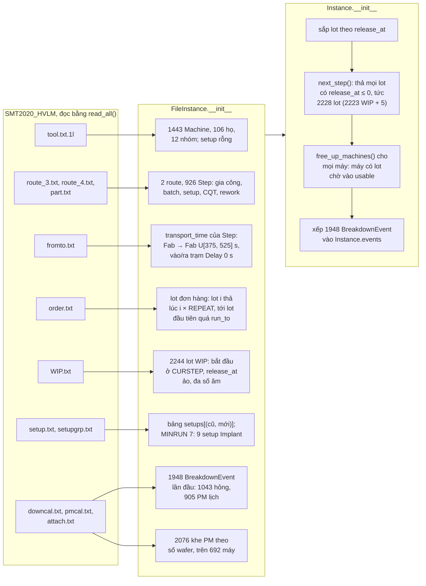
```mermaid
flowchart LR
    subgraph DS["SMT2020_HVLM, đọc bằng read_all()"]
        T["tool.txt.1l"]
        R["route_3.txt, route_4.txt,<br/>part.txt"]
        F["fromto.txt"]
        O["order.txt"]
        W["WIP.txt"]
        S["setup.txt, setupgrp.txt"]
        C["downcal.txt, pmcal.txt,<br/>attach.txt"]
    end
    subgraph FI["FileInstance.__init__"]
        M["1443 Machine, 106 họ,<br/>12 nhóm; setup rỗng"]
        RS["2 route, 926 Step: gia công,<br/>batch, setup, CQT, rework"]
        TT["transport_time của Step:<br/>Fab → Fab U[375, 525] s,<br/>vào/ra trạm Delay 0 s"]
        OL["lot đơn hàng: lot i thả<br/>lúc i × REPEAT, tới lot<br/>đầu tiên quá run_to"]
        WL["2244 lot WIP: bắt đầu<br/>ở CURSTEP, release_at<br/>ảo, đa số âm"]
        SU["bảng setups[(cũ, mới)];<br/>MINRUN 7: 9 setup Implant"]
        BR["1948 BreakdownEvent<br/>lần đầu: 1043 hỏng,<br/>905 PM lịch"]
        PP["2076 khe PM theo<br/>số wafer, trên 692 máy"]
    end
    T --> M
    R --> RS
    F --> TT
    O --> OL
    W --> WL
    S --> SU
    C --> BR
    C --> PP
    FI --> INIT
    subgraph INIT["Instance.__init__"]
        direction TB
        I1["sắp lot theo release_at"]
        I2["next_step(): thả mọi lot<br/>có release_at ≤ 0, tức<br/>2228 lot (2223 WIP + 5)"]
        I3["free_up_machines() cho<br/>mọi máy: máy có lot<br/>chờ vào usable"]
        I4["xếp 1948 BreakdownEvent<br/>vào Instance.events"]
        I1 --> I2 --> I3 --> I4
    end
```

**Điểm cần biết:**

- Khởi động lạnh: lúc t = 0 không lot nào đang gia công, mọi máy rảnh với setup rỗng, không mang
  theo cửa sổ CQT, min-run hay dedication. 11 dòng WIP sát cuối route bị bỏ; 21 lot WIP của HVLM
  có `release_at` dương nên vào giữa route trong ngày 0,01–9,7.
- Mỗi đơn thả đúng một lot mỗi `REPEAT` (LOTSPERRPT, RDIST bị bỏ qua). Lot cuối của mỗi đơn có
  `release_at` quá `run_to`, nên trong lúc chạy luôn còn lot chưa thả.
- Hỏng và PM theo lịch được xếp thành sự kiện ngay từ đầu (một `BreakdownEvent` đầu tiên cho mỗi
  máy và mỗi lịch). PM theo số wafer chỉ là bộ đếm trên máy, không có sự kiện.
- `read_all()` đọc mỗi file bằng `read_txt()` (TSV, ô nào đổi được thì thành số). fabframe truyền
  `preprocessors=[]`, nên các biến môi trường NOWIP, NOBREAKDOWN, NOPM, NOREWORK, NOSAMPLING không
  có tác dụng. LVHM: 1313 máy, 10 route với 4013 bước, 2146 lot WIP.

Mã nguồn: [read.py#L20-L60](../fabframe/kernel/vendor/simulation/read.py#L20-L60),
[file_instance.py#L12-L126](../fabframe/kernel/vendor/simulation/file_instance.py#L12-L126),
[classes.py#L24-L180](../fabframe/kernel/vendor/simulation/classes.py#L24-L180),
[instance.py#L14-L61](../fabframe/kernel/vendor/simulation/instance.py#L14-L61),
[runner.py#L211-L226](../fabframe/runner.py#L211-L226)

### B3. Vòng lặp sự kiện (lot-for-machine)

Đồng hồ mô phỏng nhảy thế nào, lúc nào dispatcher được hỏi, và mỗi loại sự kiện làm gì với tập máy
rảnh và hàng đợi lot?

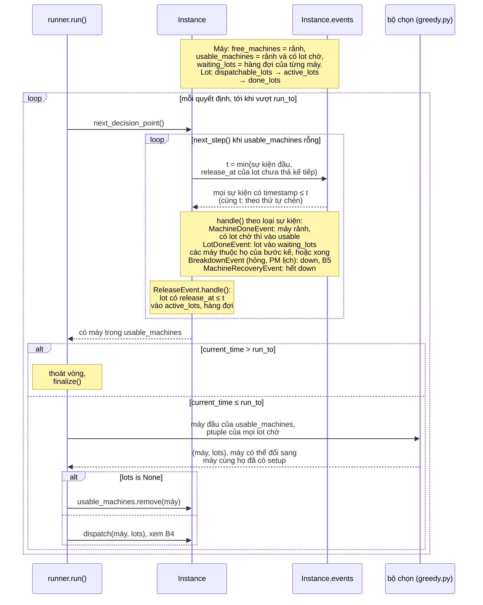
```mermaid
sequenceDiagram
    participant R as runner.run()
    participant I as Instance
    participant E as Instance.events
    participant S as bộ chọn (greedy.py)
    Note over I,E: Máy: free_machines = rảnh,<br/>usable_machines = rảnh và có lot chờ,<br/>waiting_lots = hàng đợi của từng máy.<br/>Lot: dispatchable_lots → active_lots<br/>→ done_lots
    loop mỗi quyết định, tới khi vượt run_to
        R->>I: next_decision_point()
        loop next_step() khi usable_machines rỗng
            I->>E: t = min(sự kiện đầu,<br/>release_at của lot chưa thả kế tiếp)
            E-->>I: mọi sự kiện có timestamp ≤ t<br/>(cùng t: theo thứ tự chèn)
            Note over I,E: handle() theo loại sự kiện:<br/>MachineDoneEvent: máy rảnh,<br/>có lot chờ thì vào usable<br/>LotDoneEvent: lot vào waiting_lots<br/>các máy thuộc họ của bước kế, hoặc xong<br/>BreakdownEvent (hỏng, PM lịch): down, B5<br/>MachineRecoveryEvent: hết down
            Note over I: ReleaseEvent.handle():<br/>lot có release_at ≤ t<br/>vào active_lots, hàng đợi
        end
        I-->>R: có máy trong usable_machines
        alt current_time > run_to
            Note over R: thoát vòng,<br/>finalize()
        else current_time ≤ run_to
            R->>S: máy đầu của usable_machines,<br/>ptuple của mọi lot chờ
            S-->>R: (máy, lots), máy có thể đổi sang<br/>máy cùng họ đã có setup
            alt lots is None
                R->>I: usable_machines.remove(máy)
            else
                R->>I: dispatch(máy, lots), xem B4
            end
        end
    end
```

**Điểm cần biết:**

- Mọi sự kiện cùng mốc t và mọi lot đến hạn thả được xử lý xong rồi mới hỏi dispatcher. Sau đó
  từng máy trong `usable_machines` được phục vụ lần lượt ở cùng t, nên máy trước lấy lot nào thì
  hàng đợi của máy sau đổi theo.
- Máy được hỏi trước là phần tử đầu khi duyệt set `usable_machines`, không phải máy rảnh lâu nhất.
  Dispatcher chỉ xếp hạng lot, không chọn máy.
- `lots is None` (batch chưa đủ, hoặc bị giữ vì min-run): máy rời `usable_machines` nhưng vẫn rảnh,
  và chỉ quay lại khi có lot mới vào hàng đợi của nó, hoặc sau khi bị down rồi hết down. Vòng lặp tự
  viết mà quên `remove` có thể quay mãi ở cùng t.
- Vòng chỉ dừng khi đồng hồ đã vượt `run_to`, nên trạng thái cuối gồm cả các sự kiện sau `run_to`
  cho tới khi có máy usable đầu tiên (một hoặc vài mốc t). `instance.done` không bao giờ đúng vì đơn
  hàng luôn còn lot chưa thả.

Mã nguồn: [runner.py#L262-L294](../fabframe/runner.py#L262-L294),
[greedy.py#L25-L90](../fabframe/kernel/vendor/simulation/greedy.py#L25-L90),
[dm_lot_for_machine.py#L1-L41](../fabframe/kernel/vendor/simulation/dispatching/dm_lot_for_machine.py#L1-L41),
[instance.py#L120-L142](../fabframe/kernel/vendor/simulation/instance.py#L120-L142),
[instance.py#L169-L228](../fabframe/kernel/vendor/simulation/instance.py#L169-L228),
[events.py#L1-L114](../fabframe/kernel/vendor/simulation/events.py#L1-L114),
[event_queue.py#L13-L33](../fabframe/kernel/vendor/simulation/event_queue.py#L13-L33)

### B4. Kernel áp dụng một dispatch

Khi bộ chọn trả về (máy, lots), `Instance.dispatch()` tính thời gian và cập nhật trạng thái theo
thứ tự nào?

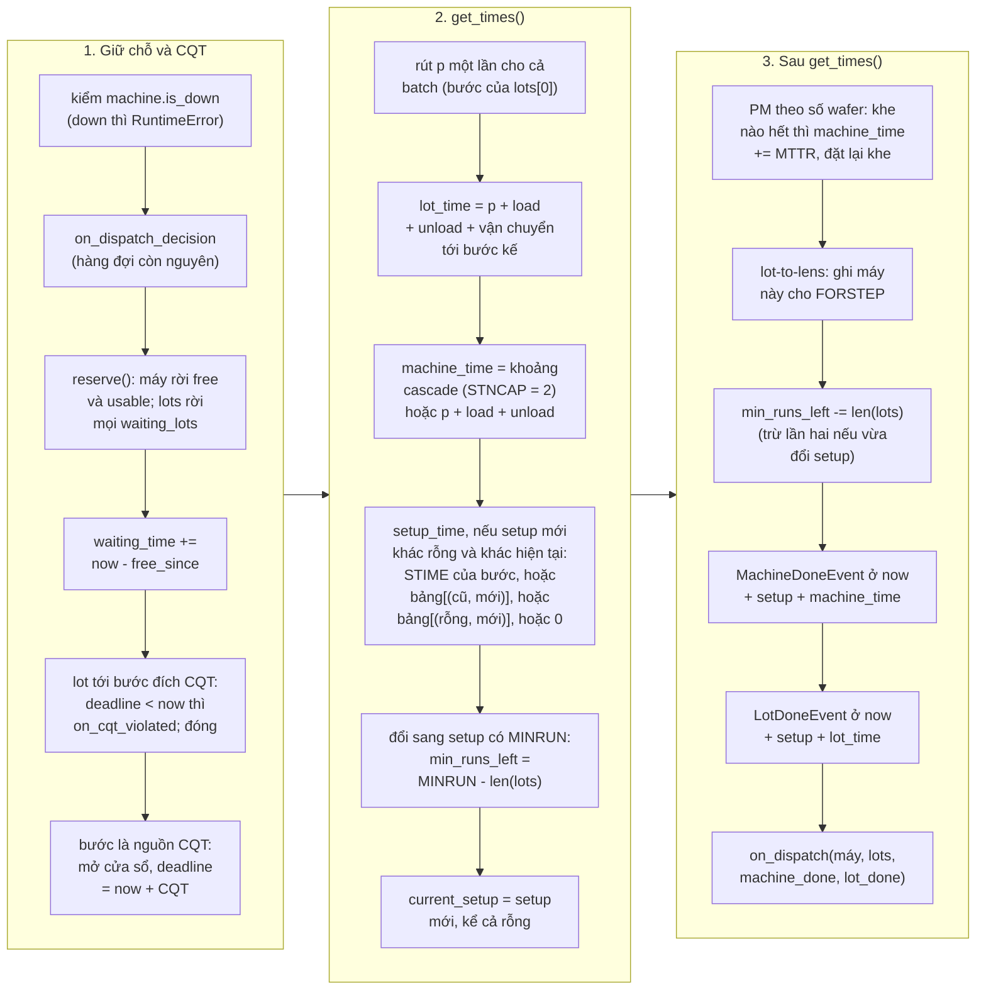
```mermaid
flowchart LR
    subgraph S1["1. Giữ chỗ và CQT"]
        direction TB
        A1["kiểm machine.is_down<br/>(down thì RuntimeError)"]
        A2["on_dispatch_decision<br/>(hàng đợi còn nguyên)"]
        A3["reserve(): máy rời free<br/>và usable; lots rời<br/>mọi waiting_lots"]
        A4["waiting_time +=<br/>now - free_since"]
        A5["lot tới bước đích CQT:<br/>deadline #lt; now thì<br/>on_cqt_violated; đóng"]
        A6["bước là nguồn CQT:<br/>mở cửa sổ, deadline<br/>= now + CQT"]
        A1 --> A2 --> A3 --> A4 --> A5 --> A6
    end
    subgraph S2["2. get_times()"]
        direction TB
        B1["rút p một lần cho cả<br/>batch (bước của lots[0])"]
        B2["lot_time = p + load<br/>+ unload + vận chuyển<br/>tới bước kế"]
        B3["machine_time = khoảng<br/>cascade (STNCAP = 2)<br/>hoặc p + load + unload"]
        B4["setup_time, nếu setup mới<br/>khác rỗng và khác hiện tại:<br/>STIME của bước, hoặc<br/>bảng[(cũ, mới)], hoặc<br/>bảng[(rỗng, mới)], hoặc 0"]
        B5["đổi sang setup có MINRUN:<br/>min_runs_left =<br/>MINRUN - len(lots)"]
        B6["current_setup = setup<br/>mới, kể cả rỗng"]
        B1 --> B2 --> B3 --> B4 --> B5 --> B6
    end
    subgraph S3["3. Sau get_times()"]
        direction TB
        C1["PM theo số wafer: khe<br/>nào hết thì machine_time<br/>+= MTTR, đặt lại khe"]
        C2["lot-to-lens: ghi máy<br/>này cho FORSTEP"]
        C3["min_runs_left -= len(lots)<br/>(trừ lần hai nếu vừa<br/>đổi setup)"]
        C4["MachineDoneEvent ở now<br/>+ setup + machine_time"]
        C5["LotDoneEvent ở now<br/>+ setup + lot_time"]
        C6["on_dispatch(máy, lots,<br/>machine_done, lot_done)"]
        C1 --> C2 --> C3 --> C4 --> C5 --> C6
    end
    S1 --> S2 --> S3
```

**Điểm cần biết:**

- Cả batch dùng chung một lần rút thời gian gia công, một lần rút thời gian vận chuyển và một
  `LotDoneEvent`, nên các lot của batch đi tiếp cùng lúc.
- Vận chuyển là thời gian thật trong `lot_time`: 375–525 s giữa hai bước trong Fab, 0 khi vào hoặc
  ra trạm Delay. Không có xe hay giới hạn sức chứa; xe OHT trong cảnh 3D chỉ là minh hoạ.
- `min_runs_left` bị trừ hai lần ở lần dispatch đổi setup, nên MINRUN 7 của Implant thực chất là
  6 lot.
- Lot không cần setup xoá setup của máy, nên lot cần setup đến sau phải setup lại. `machine_done`,
  `lot_done` gửi cho `on_dispatch` chỉ là tạm: hỏng hoặc PM lịch khi máy còn bận sẽ lùi cả hai (B5).

Mã nguồn: [instance.py#L230-L297](../fabframe/kernel/vendor/simulation/instance.py#L230-L297),
[instance.py#L299-L369](../fabframe/kernel/vendor/simulation/instance.py#L299-L369),
[dm_lot_for_machine.py#L26-L35](../fabframe/kernel/vendor/simulation/dispatching/dm_lot_for_machine.py#L26-L35)

### B5. Trạng thái một máy

Một máy đi qua những trạng thái nào, và hỏng hoặc PM theo lịch đụng vào máy đang bận khác gì máy
đang rảnh?

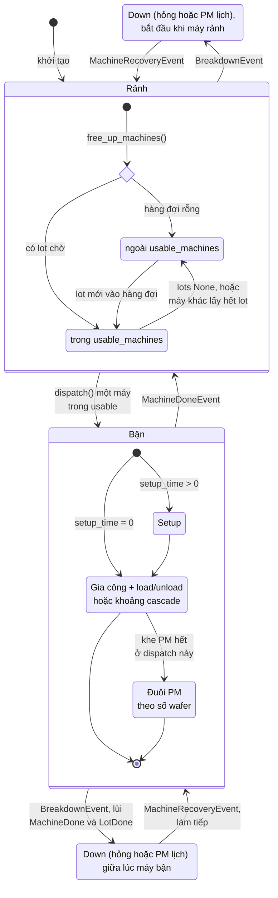
```mermaid
stateDiagram-v2
    state "Down (hỏng hoặc PM lịch), bắt đầu khi máy rảnh" as DownIdle
    state "Rảnh" as Free
    state Free {
        state "ngoài usable_machines" as Idle
        state "trong usable_machines" as Usable
        state c1 <<choice>>
        [*] --> c1: free_up_machines()
        c1 --> Idle: hàng đợi rỗng
        c1 --> Usable: có lot chờ
        Idle --> Usable: lot mới vào hàng đợi
        Usable --> Idle: lots None, hoặc<br/>máy khác lấy hết lot
    }
    state "Bận" as Busy
    state Busy {
        state "Setup" as Setup
        state "Gia công + load/unload<br/>hoặc khoảng cascade" as Proc
        state "Đuôi PM<br/>theo số wafer" as PMW
        [*] --> Setup: setup_time > 0
        [*] --> Proc: setup_time = 0
        Setup --> Proc
        Proc --> PMW: khe PM hết<br/>ở dispatch này
        Proc --> [*]
        PMW --> [*]
    }
    state "Down (hỏng hoặc PM lịch) giữa lúc máy bận" as DownBusy
    [*] --> Free: khởi tạo
    DownIdle --> Free: MachineRecoveryEvent
    Free --> DownIdle: BreakdownEvent
    Free --> Busy: dispatch() một máy<br/>trong usable
    Busy --> Free: MachineDoneEvent
    Busy --> DownBusy: BreakdownEvent, lùi<br/>MachineDone và LotDone
    DownBusy --> Busy: MachineRecoveryEvent,<br/>làm tiếp
```

**Điểm cần biết:**

- Các pha trong "Bận" không có sự kiện riêng: kernel chỉ xếp một `MachineDoneEvent` ở
  now + setup + machine_time. Máy STNCAP = 2 rảnh sau khoảng cascade, trước khi lot gia công xong,
  nên có thể nhận lot mới khi lot trước còn trên máy.
- Hỏng và PM theo lịch đi chung một đường (`BreakdownEvent` → `handle_breakdown()`), chỉ khác phân
  phối thời gian, bộ đếm `bred_time`/`pmed_time` và callback. Down chồng lên down thì `down_until`
  lấy giá trị lớn hơn, việc của máy chỉ lùi thêm phần kéo dài.
- PM theo số wafer không có sự kiện, callback hay `is_down`. Ở RNG `semantic`, lịch hỏng và PM theo
  lịch giống hệt nhau với mọi dispatcher; PM theo số wafer xảy ra ở lần dispatch làm khe hết, nên
  phụ thuộc dispatcher.
- Hỏng giữa lúc bận chỉ lùi các sự kiện còn trong hàng đợi: lot đã qua `MachineDone` (đang vận
  chuyển, hoặc còn trên máy cascade) không bị ảnh hưởng.

Mã nguồn: [instance.py#L169-L179](../fabframe/kernel/vendor/simulation/instance.py#L169-L179),
[instance.py#L262-L275](../fabframe/kernel/vendor/simulation/instance.py#L262-L275),
[instance.py#L404-L430](../fabframe/kernel/vendor/simulation/instance.py#L404-L430),
[events.py#L1-L41](../fabframe/kernel/vendor/simulation/events.py#L1-L41),
[events.py#L65-L114](../fabframe/kernel/vendor/simulation/events.py#L65-L114),
[file_instance.py#L85-L121](../fabframe/kernel/vendor/simulation/file_instance.py#L85-L121),
[dm_lot_for_machine.py#L9-L24](../fabframe/kernel/vendor/simulation/dispatching/dm_lot_for_machine.py#L9-L24)

### B6. Vòng đời một lot

Một lot đi từ lúc được tạo tới lúc xong ra sao, bước nào bị bỏ hay làm lại, và cửa sổ CQT mở, đóng
ở đâu?

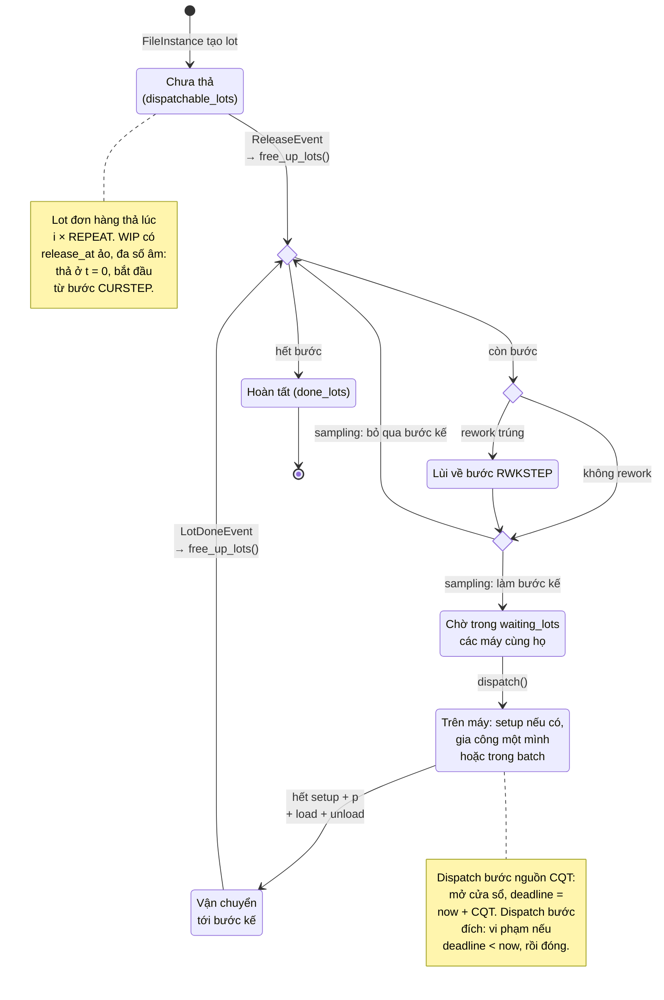
```mermaid
stateDiagram-v2
    state "Chưa thả<br/>(dispatchable_lots)" as Pending
    state more <<choice>>
    state rw <<choice>>
    state "Lùi về bước RWKSTEP" as Rewind
    state smp <<choice>>
    state "Chờ trong waiting_lots<br/>các máy cùng họ" as Waiting
    state "Trên máy: setup nếu có,<br/>gia công một mình<br/>hoặc trong batch" as Proc
    state "Vận chuyển<br/>tới bước kế" as Move
    state "Hoàn tất (done_lots)" as Done
    [*] --> Pending: FileInstance tạo lot
    Pending --> more: ReleaseEvent<br/>→ free_up_lots()
    Move --> more: LotDoneEvent<br/>→ free_up_lots()
    more --> Done: hết bước
    more --> rw: còn bước
    rw --> Rewind: rework trúng
    rw --> smp: không rework
    Rewind --> smp
    smp --> Waiting: sampling: làm bước kế
    smp --> more: sampling: bỏ qua bước kế
    Waiting --> Proc: dispatch()
    Proc --> Move: hết setup + p<br/>+ load + unload
    Done --> [*]
    note right of Pending
        Lot đơn hàng thả lúc
        i × REPEAT. WIP có
        release_at ảo, đa số âm:
        thả ở t = 0, bắt đầu
        từ bước CURSTEP.
    end note
    note right of Proc
        Dispatch bước nguồn CQT:
        mở cửa sổ, deadline =
        now + CQT. Dispatch bước
        đích: vi phạm nếu
        deadline #lt; now, rồi đóng.
    end note
```

**Điểm cần biết:**

- Cửa sổ CQT tính từ lúc dispatch bước nguồn, nên gia công, load/unload và vận chuyển của chính
  bước nguồn nằm trong cửa sổ. Ở 10/66 bước nguồn CQT của HVLM (44/264 của LVHM, đều là Dry_Etch
  với cửa sổ 1 giờ), thời gian gia công ngắn nhất đã dài hơn cửa sổ: không dispatcher nào tránh
  được vi phạm.
- Bước bị sampling bỏ qua vẫn được rút rework, nên lot có thể bị lùi về từ một bước nó chưa làm.
  Mỗi lot rút rework tối đa một lần ở mỗi bước; trong dữ liệu RWKSTEP = STEP - 2.
- Ở bước lot-to-lens, kernel ghi máy đã làm cho lot; tới bước FORSTEP, lot chỉ chờ trong hàng đợi
  của đúng máy đó, kể cả khi máy đang down.
- "Trên máy" và "Vận chuyển" không có sự kiện ở giữa: lot chỉ xuất hiện lại ở `LotDoneEvent`. Hỏng
  hoặc PM lịch khi máy còn bận làm `LotDoneEvent` của lot lùi theo.

Mã nguồn: [file_instance.py#L45-L71](../fabframe/kernel/vendor/simulation/file_instance.py#L45-L71),
[classes.py#L136-L180](../fabframe/kernel/vendor/simulation/classes.py#L136-L180),
[events.py#L44-L62](../fabframe/kernel/vendor/simulation/events.py#L44-L62),
[instance.py#L181-L228](../fabframe/kernel/vendor/simulation/instance.py#L181-L228),
[instance.py#L242-L258](../fabframe/kernel/vendor/simulation/instance.py#L242-L258),
[instance.py#L276-L279](../fabframe/kernel/vendor/simulation/instance.py#L276-L279),
[instance.py#L320-L333](../fabframe/kernel/vendor/simulation/instance.py#L320-L333),
[dm_lot_for_machine.py#L9-L17](../fabframe/kernel/vendor/simulation/dispatching/dm_lot_for_machine.py#L9-L17)

## Phần C — Một quyết định dispatch

Phần này đi từ một lần `runner.run()` xuống tới một quyết định: dispatcher nhìn thấy gì, điểm
của nó được kiểm và xếp thế nào, phần nào kernel vẫn tự quyết, và KPI được đếm ra sao.

### C1. runner.run() từ đầu đến cuối

Một lần chạy đi qua những bước nào, theo thứ tự nào, và khi xong thì ghi ra những gì?
W = `warmup_days` × 86400, D = `days` × 86400, `run_to` = W + D (giây).

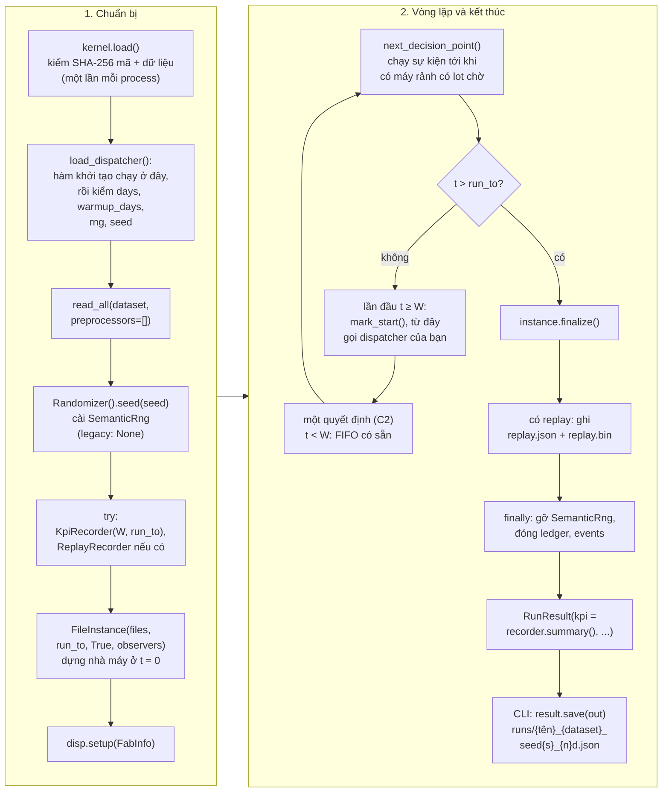
```mermaid
flowchart LR
  subgraph P["1. Chuẩn bị"]
    direction TB
    A1["kernel.load()<br/>kiểm SHA-256 mã + dữ liệu<br/>(một lần mỗi process)"]
    A2["load_dispatcher():<br/>hàm khởi tạo chạy ở đây,<br/>rồi kiểm days, warmup_days,<br/>rng, seed"]
    A4["read_all(dataset,<br/>preprocessors=[])"]
    A5["Randomizer().seed(seed)<br/>cài SemanticRng<br/>(legacy: None)"]
    A6["try:<br/>KpiRecorder(W, run_to),<br/>ReplayRecorder nếu có"]
    A7["FileInstance(files,<br/>run_to, True, observers)<br/>dựng nhà máy ở t = 0"]
    A8["disp.setup(FabInfo)"]
    A1 --> A2 --> A4 --> A5 --> A6 --> A7 --> A8
  end
  subgraph R["2. Vòng lặp và kết thúc"]
    direction TB
    B1["next_decision_point()<br/>chạy sự kiện tới khi<br/>có máy rảnh có lot chờ"]
    B2{"t > run_to?"}
    B3["lần đầu t ≥ W:<br/>mark_start(), từ đây<br/>gọi dispatcher của bạn"]
    B4["một quyết định (C2)<br/>t < W: FIFO có sẵn"]
    C1["instance.finalize()"]
    C2["có replay: ghi<br/>replay.json + replay.bin"]
    C3["finally: gỡ SemanticRng,<br/>đóng ledger, events"]
    C4["RunResult(kpi =<br/>recorder.summary(), ...)"]
    C5["CLI: result.save(out)<br/>runs/{tên}_{dataset}_<br/>seed{s}_{n}d.json"]
    B1 --> B2
    B2 -->|không| B3 --> B4 --> B1
    B2 -->|có| C1 --> C2 --> C3 --> C4 --> C5
  end
  P --> R
```

**Điểm cần biết:**
- Hàm khởi tạo (trong `load_dispatcher`) và `setup(fab)` nằm ngoài vùng dự phòng FIFO: lỗi ở đây
  dừng lần chạy (C4). Hàm khởi tạo chạy trước khi cài RNG, ngoài `try`; lỗi trong `setup()` thì
  `finally` vẫn gỡ RNG (lúc đó ledger, events chưa mở).
- Warm-up luôn dùng FIFO có sẵn. Vòng lặp dừng ở quyết định đầu tiên có t > `run_to`, nên
  `end_time_seconds` vượt `run_to` một chút.
- Replay chỉ được ghi khi vòng lặp chạy hết; lần chạy bị dừng giữa chừng không có replay, cũng
  không có file kết quả.
- File JSON do CLI ghi sau khi `run()` trả về. Tên mặc định chỉ gồm tên dispatcher, dataset, seed,
  số ngày: hai lần chạy chỉ khác warm-up hoặc `--rng` ghi đè lên nhau.

Mã nguồn: [runner.py#L172-L329](../fabframe/runner.py#L172-L329), [kernel/\_\_init\_\_.py#L88-L113](../fabframe/kernel/__init__.py#L88-L113), [loader.py#L33-L62](../fabframe/loader.py#L33-L62), [cli.py#L27-L29](../fabframe/cli.py#L27-L29), [cli.py#L56-L69](../fabframe/cli.py#L56-L69)

### C2. Một quyết định

Khi có máy rảnh, từ lúc dựng dữ liệu cho `score()` tới lúc lot lên máy có những bước gì, và ai
nhìn thấy gì? Vòng lặp là bản chép vòng lot-for-machine của kernel (`greedy.py`); khung chỉ thay
cách tính khoá xếp của từng lot.

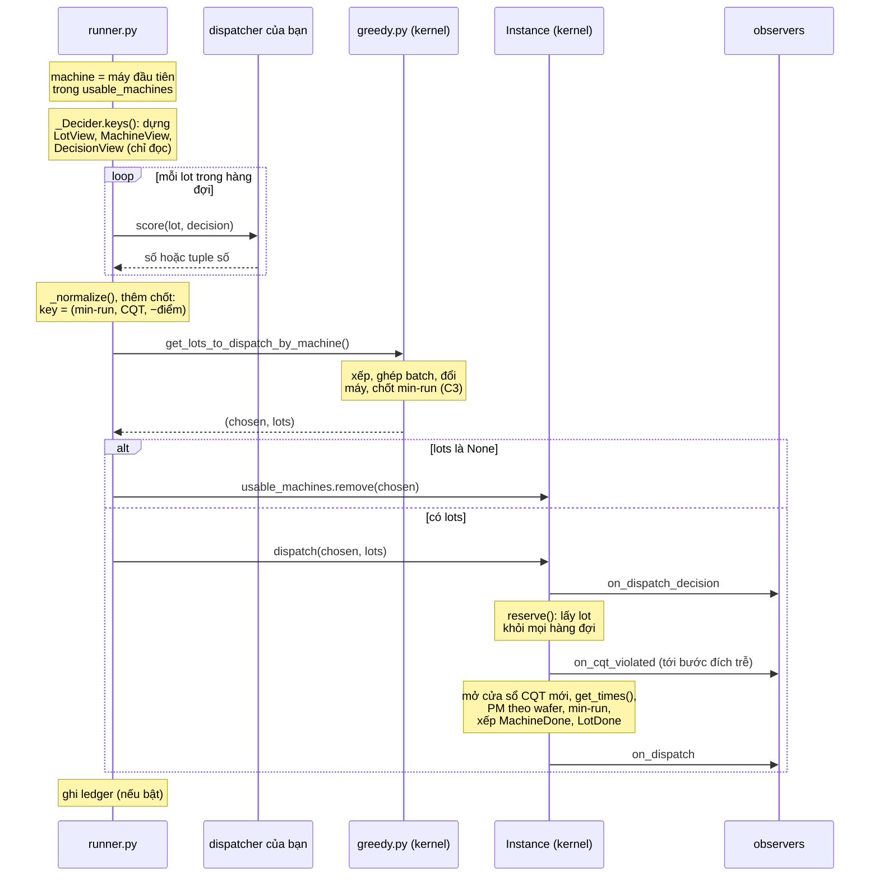
```mermaid
sequenceDiagram
  participant R as runner.py
  participant U as dispatcher của bạn
  participant S as greedy.py (kernel)
  participant I as Instance (kernel)
  participant O as observers
  Note over R: machine = máy đầu tiên<br/>trong usable_machines
  Note over R: _Decider.keys(): dựng<br/>LotView, MachineView,<br/>DecisionView (chỉ đọc)
  loop mỗi lot trong hàng đợi
    R->>U: score(lot, decision)
    U-->>R: số hoặc tuple số
  end
  Note over R: _normalize(), thêm chốt:<br/>key = (min-run, CQT, −điểm)
  R->>S: get_lots_to_dispatch_by_machine()
  Note over S: xếp, ghép batch, đổi<br/>máy, chốt min-run (C3)
  S-->>R: (chosen, lots)
  alt lots là None
    R->>I: usable_machines.remove(chosen)
  else có lots
    R->>I: dispatch(chosen, lots)
    I->>O: on_dispatch_decision
    Note over I: reserve(): lấy lot<br/>khỏi mọi hàng đợi
    I->>O: on_cqt_violated (tới bước đích trễ)
    Note over I: mở cửa sổ CQT mới, get_times(),<br/>PM theo wafer, min-run,<br/>xếp MachineDone, LotDone
    I->>O: on_dispatch
  end
  Note over R: ghi ledger (nếu bật)
```

**Điểm cần biết:**
- Máy được hỏi luôn là máy đầu tiên của tập `usable_machines`; dispatcher không chọn máy.
  `setup_time` trong `LotView` và chốt min-run tính theo máy này, nhưng bộ chọn có thể chuyển lot
  sang máy khác cùng họ (C3).
- `score()` được gọi cho mọi lot trước khi kiểm tra; một lot lỗi là cả quyết định chuyển sang
  FIFO (C4).
- `decisions` tăng ở mọi lần gọi, kể cả warm-up và cả khi bộ chọn không chạy lot nào.
- Observers (KPI, replay, plugins) chỉ quan sát. `machine_end`, `lot_end` trong `on_dispatch` là
  tạm: hỏng máy hay PM theo lịch xảy ra sau đó đẩy lùi chúng.

Mã nguồn: [runner.py#L276-L289](../fabframe/runner.py#L276-L289), [runner.py#L117-L169](../fabframe/runner.py#L117-L169), [api.py#L18-L66](../fabframe/api.py#L18-L66), [greedy.py#L25-L90](../fabframe/kernel/vendor/simulation/greedy.py#L25-L90), [instance.py#L230-L297](../fabframe/kernel/vendor/simulation/instance.py#L230-L297)

### C3. Thứ tự cuối cùng và bộ chọn của kernel

Sau khi có điểm, thứ tự cuối cùng gồm những khoá nào, và bộ chọn của kernel còn tự quyết những gì
mà điểm không đổi được?

**C3a — Khoá xếp hạng: so từ trên xuống, bằng nhau mới xét khoá dưới**

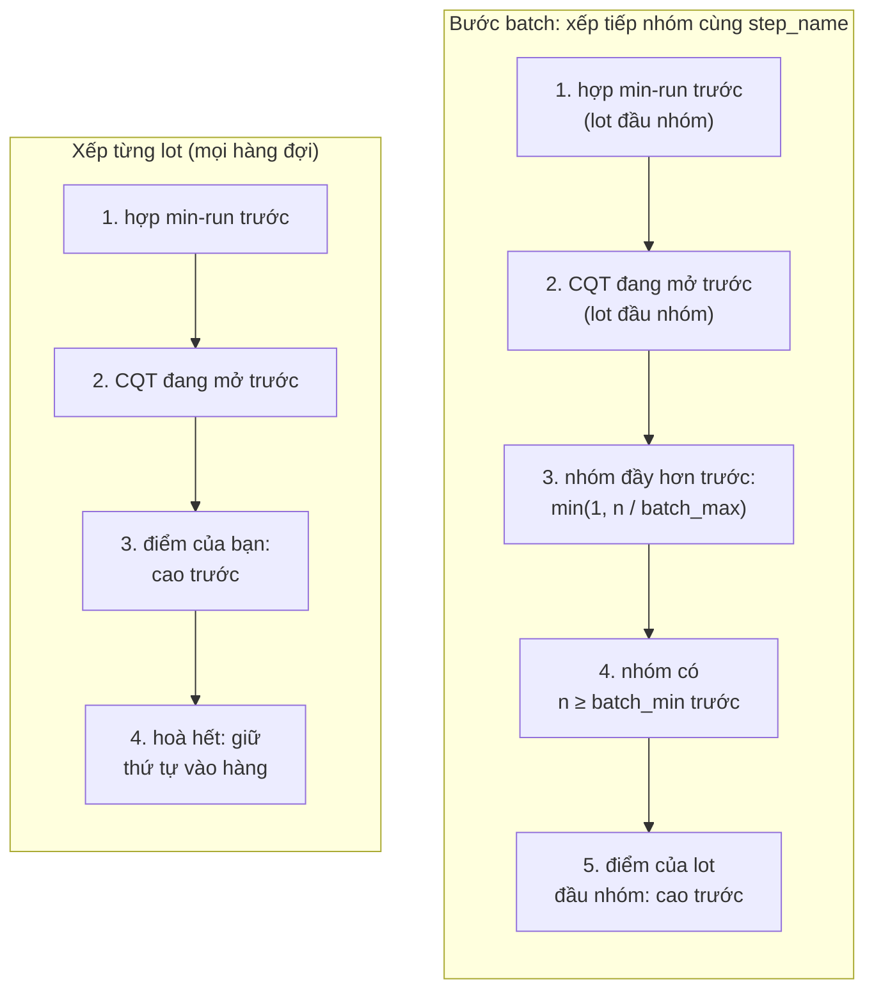
```mermaid
flowchart TD
  subgraph L2["Bước batch: xếp tiếp nhóm cùng step_name"]
    direction TB
    b1["1. hợp min-run trước<br/>(lot đầu nhóm)"] --> b2["2. CQT đang mở trước<br/>(lot đầu nhóm)"] --> b3["3. nhóm đầy hơn trước:<br/>min(1, n / batch_max)"] --> b4["4. nhóm có<br/>n ≥ batch_min trước"] --> b5["5. điểm của lot<br/>đầu nhóm: cao trước"]
  end
  subgraph L1["Xếp từng lot (mọi hàng đợi)"]
    direction TB
    a1["1. hợp min-run trước"] --> a2["2. CQT đang mở trước"] --> a3["3. điểm của bạn:<br/>cao trước"] --> a4["4. hoà hết: giữ<br/>thứ tự vào hàng"]
  end
```

**C3b — Bộ chọn `get_lots_to_dispatch_by_machine`**

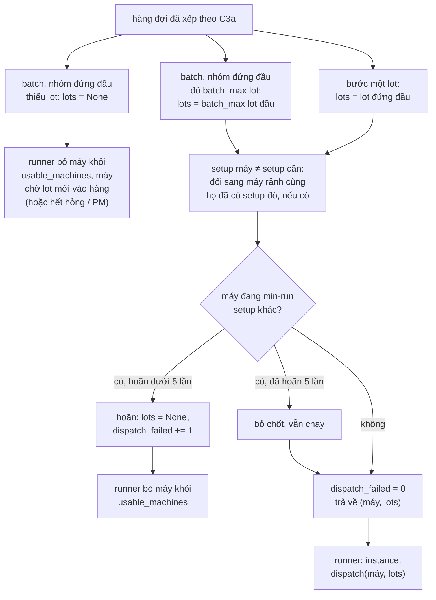
```mermaid
flowchart TD
  A["hàng đợi đã xếp theo C3a"]
  D["bước một lot:<br/>lots = lot đứng đầu"]
  G["batch, nhóm đứng đầu<br/>đủ batch_max lot:<br/>lots = batch_max lot đầu"]
  N["batch, nhóm đứng đầu<br/>thiếu lot: lots = None"]
  X1["runner bỏ máy khỏi<br/>usable_machines, máy<br/>chờ lot mới vào hàng<br/>(hoặc hết hỏng / PM)"]
  J["setup máy ≠ setup cần:<br/>đổi sang máy rảnh cùng<br/>họ đã có setup đó, nếu có"]
  K{"máy đang min-run<br/>setup khác?"}
  M["hoãn: lots = None,<br/>dispatch_failed += 1"]
  X2["runner bỏ máy khỏi<br/>usable_machines"]
  Q["bỏ chốt, vẫn chạy"]
  OK["dispatch_failed = 0<br/>trả về (máy, lots)"]
  Y["runner: instance.<br/>dispatch(máy, lots)"]
  A --> G
  A --> D
  A --> N
  G --> J
  D --> J
  J --> K
  N --> X1
  K -->|"có, hoãn dưới 5 lần"| M --> X2
  K -->|"có, đã hoãn 5 lần"| Q --> OK
  K -->|không| OK
  OK --> Y
```

**Điểm cần biết:**
- Điểm của bạn chỉ phân định trong cùng một mức của các khoá đứng trước. Lot đầu nhóm là lot xếp
  cao nhất của nhóm theo cột trái; hoà hoàn toàn thì giữ thứ tự vào hàng đợi (không xét `id`).
- Bước batch chỉ chạy batch đủ `batch_max` lot; `batch_min` chỉ là một khoá xếp. Vì chốt CQT đứng
  trước độ đầy, một nhóm thiếu đang có CQT có thể để máy rảnh trong khi nhóm khác đã đầy.
- Lần dispatch đổi setup trừ bộ đếm min-run hai lần (trong `get_times` rồi trong `dispatch`), nên
  MINRUN 7 thực tế là 6 lot; chốt còn bị bỏ sau 5 lần hoãn.
- Dispatcher không chọn được máy, không ép được batch thiếu, không giữ máy chờ, không vượt được hai
  chốt.

Mã nguồn: [runner.py#L161-L169](../fabframe/runner.py#L161-L169), [runner.py#L279-L283](../fabframe/runner.py#L279-L283), [greedy.py#L25-L90](../fabframe/kernel/vendor/simulation/greedy.py#L25-L90), [instance.py#L281-L285](../fabframe/kernel/vendor/simulation/instance.py#L281-L285), [instance.py#L356-L362](../fabframe/kernel/vendor/simulation/instance.py#L356-L362)

### C4. Bảo vệ và FIFO dự phòng

Điểm thế nào thì hợp lệ, điểm lỗi thì chuyện gì xảy ra, và lỗi nào nằm ngoài vùng bảo vệ?

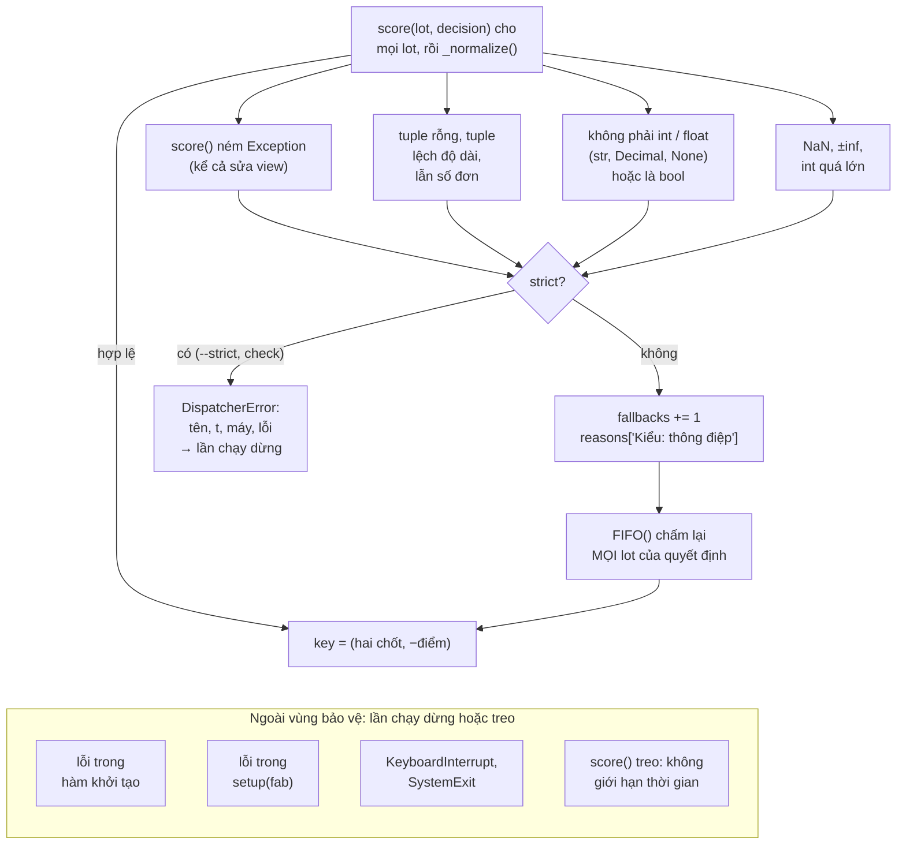
```mermaid
flowchart TD
  A["score(lot, decision) cho<br/>mọi lot, rồi _normalize()"]
  B1["score() ném Exception<br/>(kể cả sửa view)"]
  B2["tuple rỗng, tuple<br/>lệch độ dài,<br/>lẫn số đơn"]
  B3["không phải int / float<br/>(str, Decimal, None)<br/>hoặc là bool"]
  B4["NaN, ±inf,<br/>int quá lớn"]
  S{"strict?"}
  DE["DispatcherError:<br/>tên, t, máy, lỗi<br/>→ lần chạy dừng"]
  FB["fallbacks += 1<br/>reasons['Kiểu: thông điệp']"]
  FF["FIFO() chấm lại<br/>MỌI lot của quyết định"]
  OK["key = (hai chốt, −điểm)"]
  A -->|hợp lệ| OK
  A --> B1 & B2 & B3 & B4
  B1 & B2 & B3 & B4 --> S
  S -->|"có (--strict, check)"| DE
  S -->|không| FB --> FF --> OK
  subgraph NG["Ngoài vùng bảo vệ: lần chạy dừng hoặc treo"]
    direction TB
    N1["lỗi trong<br/>hàm khởi tạo"]
    N2["lỗi trong<br/>setup(fab)"]
    N3["KeyboardInterrupt,<br/>SystemExit"]
    N4["score() treo: không<br/>giới hạn thời gian"]
  end
  OK ~~~ NG
```

**Điểm cần biết:**
- Dự phòng áp cho cả quyết định, không riêng lot lỗi; hai chốt vẫn đứng trước điểm FIFO.
- Chỉ nhận `int` / `float` thật. Kiểu số không kế thừa `int`/`float` (như `numpy.float32`, tensor)
  cũng bị từ chối, nên hãy đổi sang `float()` trước khi trả.
- Lý do được gom theo chuỗi `Kiểu: thông điệp` (120 ký tự đầu), `RunResult` chỉ giữ 10 lý do nhiều
  nhất; `decisions` tính cả warm-up nên tỉ lệ `fallbacks / decisions` bị thấp đi.
- `check` chỉ in "LỖI: dispatcher không hợp lệ" cho `DispatcherError`; lỗi khởi tạo hay `setup()`
  hiện traceback. Giới hạn thời gian duy nhất là 300 s của nút kiểm tra trong giao diện web.

Mã nguồn: [runner.py#L77-L101](../fabframe/runner.py#L77-L101), [runner.py#L144-L159](../fabframe/runner.py#L144-L159), [runner.py#L199-L200](../fabframe/runner.py#L199-L200), [runner.py#L227-L230](../fabframe/runner.py#L227-L230), [loader.py#L116-L122](../fabframe/loader.py#L116-L122), [cli.py#L72-L86](../fabframe/cli.py#L72-L86)

### C5. Tám luật Paper 4

Mỗi luật có sẵn so hai lot theo những khoá nào, theo thứ tự nào? Mỗi cột là một luật, đứng sau hai
chốt của C3: ô trên so trước, bằng nhau mới xuống ô dưới. Ô ghi đúng phần tử `score()` trả về: lớn
hơn chạy trước, nên có dấu trừ là nhỏ hơn đi trước (`-lot.due`: hạn sớm trước, `-lot.cr`: CR nhỏ
trước).

**C5a — FIFO, CR, CQT-savable-first, Uniform**

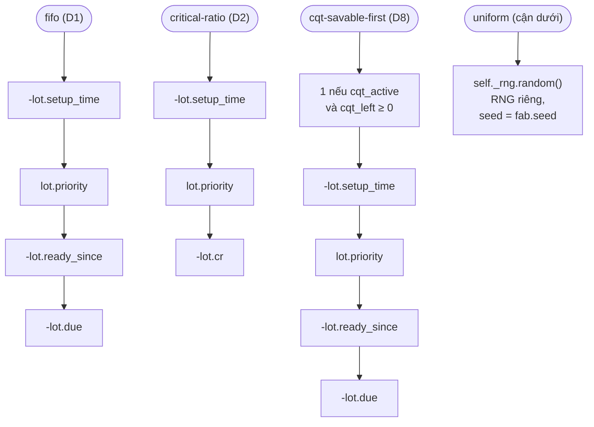
```mermaid
flowchart TD
  hF(["fifo (D1)"]) --> f1["-lot.setup_time"] --> f2["lot.priority"] --> f3["-lot.ready_since"] --> f4["-lot.due"]
  hC(["critical-ratio (D2)"]) --> r1["-lot.setup_time"] --> r2["lot.priority"] --> r3["-lot.cr"]
  hS(["cqt-savable-first (D8)"]) --> s0["1 nếu cqt_active<br/>và cqt_left ≥ 0"] --> s1["-lot.setup_time"] --> s2["lot.priority"] --> s3["-lot.ready_since"] --> s4["-lot.due"]
  hU(["uniform (cận dưới)"]) --> u1["self._rng.random()<br/>RNG riêng,<br/>seed = fab.seed"]
```

**C5b — ATC, SRPT, ATC-CQT, SRPT-CQT**

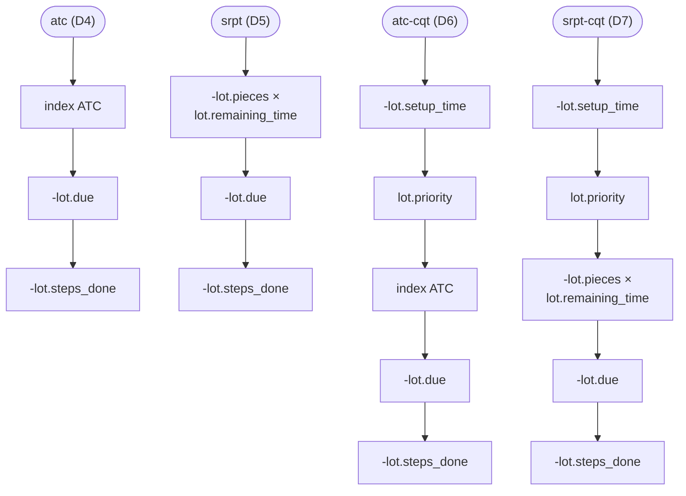
```mermaid
flowchart TD
  hA(["atc (D4)"]) --> a1["index ATC"] --> a2["-lot.due"] --> a3["-lot.steps_done"]
  hR(["srpt (D5)"]) --> p1["-lot.pieces ×<br/>lot.remaining_time"] --> p2["-lot.due"] --> p3["-lot.steps_done"]
  hQ(["atc-cqt (D6)"]) --> b1["-lot.setup_time"] --> b2["lot.priority"] --> b3["index ATC"] --> b4["-lot.due"] --> b5["-lot.steps_done"]
  hT(["srpt-cqt (D7)"]) --> q1["-lot.setup_time"] --> q2["lot.priority"] --> q3["-lot.pieces ×<br/>lot.remaining_time"] --> q4["-lot.due"] --> q5["-lot.steps_done"]
```

**Điểm cần biết:**
- index ATC = priority / p × e^(−max(0, due − now − p) / (k × p̄)), p = `lot.step_time`, k = 2
  (`-o k=3` đổi k, tên thành `ATC (k=3)`). p̄ = trung bình `step_time` của lot đầu (theo thứ tự
  hàng đợi) mỗi nhóm `step_name` đủ `batch_min` (không nhóm nào đủ thì lấy mọi nhóm); máy đang
  min-run thì chỉ các nhóm cùng setup đó (nếu có). Tính một lần mỗi quyết định, bằng float thường:
  lot còn xa hạn có index về 0 và khi đó xếp theo hạn.
- FIFO và CR là khoá `fifo` / `cr` của kernel đổi dấu, nên trùng kernel từng lần dispatch.
- ATC-CQT và SRPT-CQT chỉ khác ATC, SRPT ở tiền tố chung với FIFO, CR (ít setup → ưu tiên cao);
  ATC và SRPT không xét `setup_time`.
- Uniform dùng `random.Random(fab.seed)` riêng, không đụng RNG của nhà máy. D3 minimum-batch của
  Paper 4 không có: chọn batch là việc của bộ chọn kernel.

Mã nguồn: [classic.py#L31-L177](../fabframe/dispatchers/classic.py#L31-L177), [dispatchers/\_\_init\_\_.py#L14-L23](../fabframe/dispatchers/__init__.py#L14-L23), [dispatcher.py#L21-L44](../fabframe/kernel/vendor/simulation/dispatching/dispatcher.py#L21-L44)

### C6. RNG theo sự kiện

Một số ngẫu nhiên của kernel (thời gian sửa máy, thời gian gia công, ...) được tạo ra thế nào, và
phần nào giữ nguyên khi đổi dispatcher?

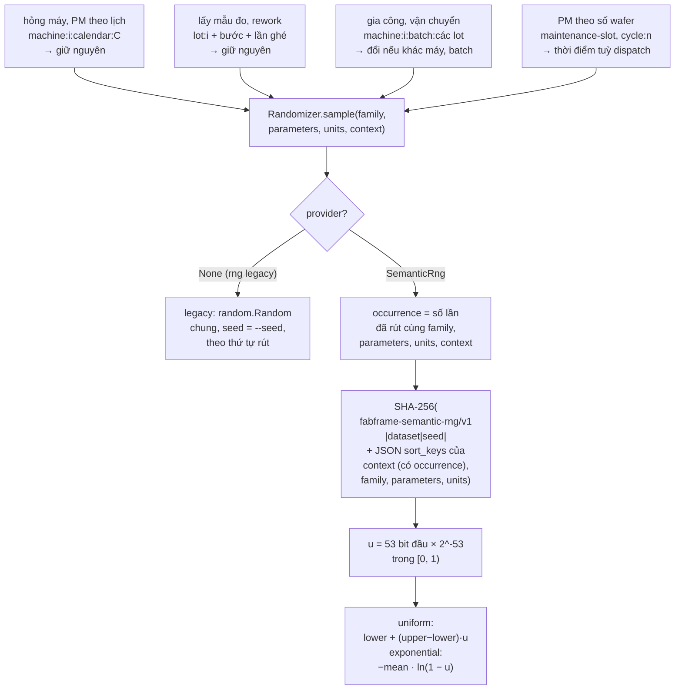
```mermaid
flowchart TD
  K1["hỏng máy, PM theo lịch<br/>machine:i:calendar:C<br/>→ giữ nguyên"]
  K2["lấy mẫu đo, rework<br/>lot:i + bước + lần ghé<br/>→ giữ nguyên"]
  K3["gia công, vận chuyển<br/>machine:i:batch:các lot<br/>→ đổi nếu khác máy, batch"]
  K4["PM theo số wafer<br/>maintenance-slot, cycle:n<br/>→ thời điểm tuỳ dispatch"]
  A["Randomizer.sample(family,<br/>parameters, units, context)"]
  C{"provider?"}
  L["legacy: random.Random<br/>chung, seed = --seed,<br/>theo thứ tự rút"]
  E["occurrence = số lần<br/>đã rút cùng family,<br/>parameters, units, context"]
  F["SHA-256(<br/>fabframe-semantic-rng/v1<br/>|dataset|seed|<br/>+ JSON sort_keys của<br/>context (có occurrence),<br/>family, parameters, units)"]
  G["u = 53 bit đầu × 2^-53<br/>trong [0, 1)"]
  H["uniform:<br/>lower + (upper−lower)·u<br/>exponential:<br/>−mean · ln(1 − u)"]
  K1 & K2 & K3 & K4 --> A --> C
  C -->|"None (rng legacy)"| L
  C -->|"SemanticRng"| E --> F --> G --> H
```

**Điểm cần biết:**
- `occurrence` đếm riêng cho từng ngữ cảnh: lần sửa thứ k của cùng máy, cùng lịch luôn ra cùng số,
  bất kể kernel đã rút bao nhiêu số khác trước đó. Phân phối hằng (vd. chu kỳ PM theo lịch) không
  rút số nào.
- Thời gian vận chuyển Fab→Fab là uniform 375–525 s, cộng vào thời điểm lot xong bước. Với PM theo
  số wafer, chỉ thời gian sửa của chu kỳ thứ n là cố định.
- Ở `legacy` mọi số đi theo một dòng chung, nên đổi thứ tự dispatch là đổi cả sự cố.
- `runner.run()` cài `SemanticRng` vào `Randomizer` (singleton của cả process) trước khi dựng nhà
  máy và gỡ ra trong `finally`. Bảng `occurrence` không được dọn trong một lần chạy.

Mã nguồn: [rng.py#L18-L42](../fabframe/rng.py#L18-L42), [randomizer.py#L23-L97](../fabframe/kernel/vendor/simulation/randomizer.py#L23-L97), [tools.py#L18-L66](../fabframe/kernel/vendor/simulation/tools.py#L18-L66), [events.py#L80-L114](../fabframe/kernel/vendor/simulation/events.py#L80-L114), [instance.py#L262-L275](../fabframe/kernel/vendor/simulation/instance.py#L262-L275), [instance.py#L299-L342](../fabframe/kernel/vendor/simulation/instance.py#L299-L342), [runner.py#L212-L214](../fabframe/runner.py#L212-L214)

### C7. Warm-up, cửa sổ đo và KPI

Đoạn thời gian nào được tính KPI, replay của giao diện phủ đoạn nào, và mỗi KPI đếm từ callback
nào của kernel?

**C7a — Trục thời gian**

```mermaid
flowchart LR
  W["0 ≤ t < W: warm-up<br/>FIFO có sẵn,<br/>không tính KPI"]
  K["W ≤ t ≤ W + D:<br/>kỳ đo KPI, gồm hai đầu,<br/>dispatcher của bạn chạy"]
  E["dừng vòng lặp,<br/>đo wip_end"]
  RP["replay giao diện:<br/>W → W + min(D, 60 ngày)<br/>(dòng lệnh: --replay-days,<br/>mặc định 30)"]
  W -->|"quyết định đầu có<br/>t ≥ W: mark_start()"| K
  K -->|"quyết định đầu<br/>có t > W + D"| E
  K -.- RP
```

**C7b — Từ callback tới KPI**

```mermaid
flowchart LR
  subgraph CB["KpiRecorder: callback, lọc t trong kỳ đo"]
    c1["on_lot_done<br/>(done_at trong kỳ)"]
    c2["on_step_done<br/>(step khác None)"]
    c3["on_cqt_violated<br/>(lúc dispatch bước đích)"]
    c4["on_dispatch"]
    c5["mark_start() và cuối kỳ:<br/>Σ utilized_time,<br/>Σ setuped_time"]
    c6["sau vòng lặp:<br/>len(active_lots)"]
  end
  subgraph KP["result.kpi"]
    k1["lots_completed,<br/>throughput_per_day,<br/>on_time_rate,<br/>mean_cycle_time_days,<br/>mean_tardiness_hours,<br/>per_product"]
    k2["moves, moves_per_day"]
    k3["cqt_violations"]
    k4["dispatches,<br/>mean_batch_size, setups"]
    k5["busy_share, setup_share<br/>= phần tăng / (số máy × D)"]
    k6["wip_end"]
  end
  c1 --> k1
  c2 --> k2
  c3 --> k3
  c4 --> k4
  c5 --> k5
  c6 --> k6
```

**Điểm cần biết:**
- Bộ đếm lọc theo thời điểm sự kiện, không theo pha; còn `decisions`, `dispatcher_seconds` và
  ledger thì gồm cả warm-up.
- `moves` không đếm bước cuối của lot hoàn tất và được đếm lúc lot được giải phóng (sau vận
  chuyển). `setups` đếm lần setup của máy đổi sang một giá trị khác rỗng, kể cả lần đổi tốn 0 giây
  và lần setup lại sau khi kernel xoá setup về `''`.
- `busy_share` ghi lúc dispatch: toàn bộ `machine_time` (gia công hoặc khoảng cascade, cộng
  nạp/dỡ nếu máy không cascade) của job bắt đầu trong kỳ, kể cả phần chạy quá mốc cuối; không gồm
  setup, PM, hỏng; mẫu số gồm cả thời gian máy hỏng.
- `cqt_violations` chỉ đếm khi lot được dispatch ở bước đích; lot còn chờ quá hạn cuối kỳ không
  được đếm. Chạy ngắn thì cycle time do lot WIP ban đầu chi phối (`release_at` do kernel suy ra,
  thường âm). `per_product` chỉ có `completed`, `on_time_rate`, `mean_cycle_time_days`.

Mã nguồn: [kpi.py#L38-L160](../fabframe/kpi.py#L38-L160), [runner.py#L218-L224](../fabframe/runner.py#L218-L224), [runner.py#L258-L271](../fabframe/runner.py#L258-L271), [server.py#L59-L60](../fabframe/ui/server.py#L59-L60), [server.py#L292](../fabframe/ui/server.py#L292), [instance.py#L363-L368](../fabframe/kernel/vendor/simulation/instance.py#L363-L368)

## Phần D — Giao diện web và replay 3D

Phần này theo một lần chạy từ nút ▶ **Chạy** trên trình duyệt tới hình 3D: server xếp hàng và chạy
mô phỏng trong một tiến trình riêng, mô phỏng ghi replay khi kết thúc, trình duyệt dựng lại trạng thái
máy theo đồng hồ replay. Giao diện mở bằng `python -m fabframe ui`.

### D1. Vòng đời một lần chạy trên web

Bấm ▶ **Chạy** thì ai làm gì, file nào trong `runs/ui/<id>/` được ghi lúc nào, và trình duyệt biết lần
chạy đã xong bằng cách nào? Mô phỏng chạy trong tiến trình `python -m fabframe run` riêng; trình duyệt chỉ
hỏi server theo chu kỳ.

```mermaid
sequenceDiagram
    autonumber
    participant B as Trình duyệt<br/>(app.js)
    participant S as server.py<br/>(luồng HTTP)
    participant Q as Luồng scheduler<br/>(trong server.py)
    participant P as Tiến trình con<br/>fabframe run
    participant F as runs/ui/#lt;id#gt;/

    B->>S: POST /api/runs<br/>+ X-Fabframe-Token
    S->>F: create_run(): bản chụp .py ("Của tôi"),<br/>request.json, status.json = queued
    S->>Q: id vào _queue<br/>(chỉ trong RAM)
    S-->>B: run_id
    Note over Q: mỗi 0,3 s, nếu<br/>còn chỗ (max_parallel)
    Q->>P: Popen fabframe run …<br/>--out --events --replay<br/>--quiet, ra log.txt
    Q->>F: status.json = running
    par Mô phỏng chạy
        loop mỗi min(1 ngày, tổng/50)
            P->>F: thêm 1 dòng<br/>events.jsonl
        end
    and Trình duyệt hỏi tiến độ
        loop mỗi 1 s khi còn lần chạy chờ / chạy (không thì 5 s)
            B->>S: GET /api/runs
            S->>F: đọc status.json và dòng cuối events.jsonl
            S-->>B: state, progress<br/>"Đang chạy N%"
        end
    end
    P->>F: xong: replay.bin, .json,<br/>result.json, tóm tắt
    Q->>F: poll() thấy tiến trình đã thoát: status.json = done<br/>(mã 0 và có result.json), không thì failed
    B->>S: GET /api/runs
    S-->>B: done, has_replay
    B->>S: GET replay.json và<br/>replay.bin song song
    S->>F: lần đầu: tạo replay.*.gz (file > 32 KiB)
    S-->>B: nội dung gzip<br/>(no-store)
    B->>B: decodeReplay(),<br/>setReplay(), phát
```

**Điểm cần biết:**
- Hàng đợi và danh sách tiến trình con chỉ nằm trong RAM của server. Server chết khi lần chạy còn chờ /
  chạy (hoặc tắt khi còn lần chạy chờ) thì lần chạy đó hiện `interrupted` (xem D2); không có gì tự chạy lại.
- Replay chỉ được ghi khi mô phỏng chạy hết; tiến trình bị huỷ hay bị giết giữa chừng (tắt máy, khởi động
  lại) không để lại replay. Với `--quiet`, `log.txt` chỉ có tóm tắt cuối, `print` của dispatcher và
  traceback.
- Lần chạy dispatcher "Của tôi" dùng bản chụp một file trong `runs/ui/<id>/`. Module phụ nằm cạnh file
  gốc không được chép theo, nên `import` nó sẽ lỗi khi chạy dù nút ✓ kiểm tra nhanh báo OK (nút này chạy
  file gốc).
- Chỉ lần chạy đang được chọn mới tự mở trong 3D khi xong.

Mã nguồn: [ui/server.py#L240-L274](../fabframe/ui/server.py#L240-L274),
[ui/server.py#L282-L326](../fabframe/ui/server.py#L282-L326),
[ui/server.py#L342-L368](../fabframe/ui/server.py#L342-L368),
[ui/server.py#L599-L605](../fabframe/ui/server.py#L599-L605),
[runner.py#L240-L256](../fabframe/runner.py#L240-L256),
[runner.py#L294-L303](../fabframe/runner.py#L294-L303),
[cli.py#L56-L69](../fabframe/cli.py#L56-L69),
[app.js#L496-L545](../fabframe/ui/static/app.js#L496-L545),
[app.js#L625-L629](../fabframe/ui/static/app.js#L625-L629),
[app.js#L350-L393](../fabframe/ui/static/app.js#L350-L393)

### D2. Trạng thái một lần chạy

Một lần chạy có những trạng thái nào, cái gì làm nó đổi trạng thái, và vì sao có lần chạy hiện
`interrupted`? Trạng thái nằm trong `status.json`, riêng `interrupted` do API tính ra lúc đọc.

```mermaid
stateDiagram-v2
    state "Server đang giữ id (_queue, _procs)" as ACTIVE {
        state "queued (chờ)" as queued
        state "running (đang chạy)" as running
        [*] --> queued: POST /api/runs
        queued --> running: còn chỗ, Popen
    }
    state "done (xong)" as done
    state "failed (lỗi)" as failed
    state "cancelled (đã huỷ)" as cancelled
    state "interrupted (bị ngắt)" as interrupted
    running --> done: tiến trình thoát mã 0<br/>và có result.json
    ACTIVE --> failed: _start() lỗi, mã ≠ 0<br/>hoặc thiếu result.json
    ACTIVE --> cancelled: Huỷ, hoặc Ctrl+C<br/>khi đang chạy
    ACTIVE --> interrupted: server không<br/>còn giữ id
    done --> [*]: DELETE
    failed --> [*]: DELETE
    cancelled --> [*]: DELETE
    interrupted --> [*]: DELETE
    note right of interrupted
        Không lưu ở đâu cả.
        API tính ra khi
        status.json còn ghi
        running / queued mà
        server không giữ id
    end note
```

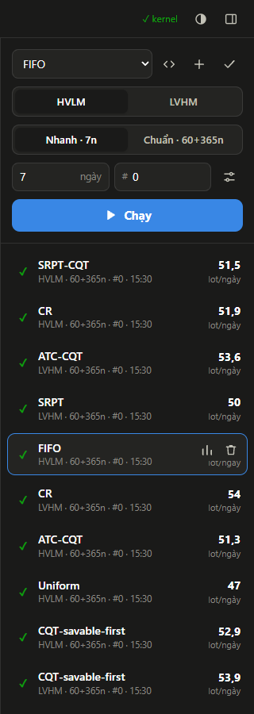

Bảng bên phải: chọn luật và dữ liệu, ▶ Chạy, danh sách lần chạy với biểu tượng trạng thái

**Điểm cần biết:**
- `interrupted` xuất hiện khi server chết (bị kill, tắt máy, khởi động lại) lúc lần chạy còn chờ / chạy.
  Ctrl+C huỷ các lần đang chạy (`cancelled`), còn lần đang chờ thì hiện `interrupted` ở lần mở sau. Không
  có gì tự chạy tiếp; chỉ xoá được.
- Server bị kill thì tiến trình con có thể vẫn chạy tới cuối và ghi `result.json` + replay, nhưng giao
  diện vẫn báo `interrupted`. Luồng scheduler chỉ bắt lỗi quanh `_start()`: một lỗi ghi `status.json`
  (ví dụ file đang bị chương trình khác mở) làm luồng dừng hẳn; lần chạy vừa xong hiện `interrupted`, các
  lần khác kẹt ở chờ / chạy tới khi khởi động lại server.
- Huỷ chỉ áp cho lần đang chờ / chạy; xoá bị từ chối (409) khi đang chờ / chạy. Trên Windows, file đang
  mở có thể làm xoá dở dang (500).
- Danh sách lần chạy hiện biểu tượng: … chờ, • đang chạy, ✓ xong, ✕ lỗi, ⊘ đã huỷ, ! bị ngắt.

Mã nguồn: [ui/server.py#L271](../fabframe/ui/server.py#L271),
[ui/server.py#L282-L332](../fabframe/ui/server.py#L282-L332),
[ui/server.py#L430-L449](../fabframe/ui/server.py#L430-L449),
[ui/server.py#L459-L471](../fabframe/ui/server.py#L459-L471),
[ui/server.py#L674-L688](../fabframe/ui/server.py#L674-L688),
[app.js#L11](../fabframe/ui/static/app.js#L11),
[app.js#L566-L596](../fabframe/ui/static/app.js#L566-L596)

### D3. Lớp bảo vệ của server

Server lưu và chạy được code Python gửi lên, nên mỗi yêu cầu phải qua mấy lớp kiểm tra. Token phiên tới
trang bằng đường nào, và nó chặn được ai?

```mermaid
flowchart TD
    subgraph TOKEN["Token phiên tới trang"]
        direction LR
        T1["Khởi động UiApp:<br/>token_urlsafe(24)"] --> T2["GET / chèn token<br/>vào index.html"]
        T2 --> T3["app.js đọc meta,<br/>api() gửi header"]
    end
    TOKEN --> REQ["Yêu cầu tới 127.0.0.1<br/>(server chỉ nghe ở đó)"]
    REQ --> C1["① Host là 127.0.0.1:port<br/>hoặc localhost:port<br/>(sai → 403)"]
    C1 --> C2["② POST, DELETE:<br/>X-Fabframe-Token đúng<br/>(sai → 403)"]
    C2 --> C3["③ POST, DELETE:<br/>Content-Type JSON<br/>(sai → 415)"]
    C3 --> C4["④ POST: body tối đa<br/>400 000 byte (quá → 413,<br/>body vẫn được đọc bỏ)"]
    C4 --> C5["⑤ đường dẫn, id, tên<br/>file, JSON, trạng thái<br/>(sai → 400 / 404 / 409)"]
    C5 --> C6["Code người dùng: server<br/>chỉ compile(), kiểm tra<br/>và chạy ở tiến trình con"]
    WEB["Trang web khác"] -. "Host lạ:<br/>dừng ở ①" .-> C1
    WEB -. "không có token:<br/>dừng ở ②" .-> C2
    LOCAL["Tiến trình khác<br/>trên cùng máy"] -. "GET /: đọc<br/>được token" .-> TOKEN
    LOCAL -. "gửi kèm token:<br/>qua cả ① tới ⑤" .-> REQ
```

**Điểm cần biết:**
- Token đổi mỗi lần khởi động server; trang mở từ trước sẽ nhận 403 "thiếu hoặc sai token phiên; tải lại
  trang". `GET` và `HEAD` không cần token: bước ② đến ④ chỉ áp cho `POST` và `DELETE`.
- Với trang web khác, bước ① chặn DNS rebinding, bước ② chặn mọi yêu cầu ghi: trang khác origin không
  đọc được HTML có token, cũng không gửi được header riêng khi chưa qua preflight (server trả 501 cho
  `OPTIONS`).
- Token không chặn tiến trình khác trên cùng máy: chỉ cần `GET /` với Host đúng là có token, rồi lưu và
  chạy Python tuỳ ý dưới quyền người mở giao diện. Danh sách lần chạy, kết quả, nhật ký, code đã chạy và
  replay thì đọc được không cần token.
- Trang và API trả kèm `Content-Security-Policy`, `nosniff`, `no-referrer`. Lệnh chạy là danh sách argv,
  không qua shell; tham số dispatcher đi dạng `-o key=repr(value)`.

Mã nguồn: [ui/server.py#L142](../fabframe/ui/server.py#L142),
[ui/server.py#L485-L511](../fabframe/ui/server.py#L485-L511),
[ui/server.py#L519-L575](../fabframe/ui/server.py#L519-L575),
[ui/server.py#L584-L596](../fabframe/ui/server.py#L584-L596),
[ui/server.py#L196-L225](../fabframe/ui/server.py#L196-L225),
[ui/server.py#L653-L671](../fabframe/ui/server.py#L653-L671),
[index.html#L6](../fabframe/ui/static/index.html#L6), [app.js#L6](../fabframe/ui/static/app.js#L6),
[app.js#L51-L63](../fabframe/ui/static/app.js#L51-L63)

### D4. Ghi replay (ReplayRecorder)

Replay được ghi từ đâu, gồm những gì, ghi lúc nào và phủ khoảng thời gian nào? `ReplayRecorder` là một
observer chỉ đọc của kernel; nó không đổi mô phỏng.

```mermaid
flowchart TD
    RUN["runner.run(replay=…):<br/>ReplayRecorder ghi<br/>từ warm_end, dài<br/>replay_days ngày (cắt<br/>ở cuối lần chạy)"]
    RUN -- "callback trong warm-up" --> PRE["Nhớ máy đang bận,<br/>đoạn hỏng / PM còn dở"]
    PRE -- "callback đầu<br/>trong cửa sổ" --> ENTER["_enter(): mang sang<br/>thành hàng t = 0"]
    RUN -- "callback trong cửa sổ" --> CB
    ENTER --> CB
    subgraph CB["Callback → cột trong RAM"]
        direction TB
        OPEN["on_dispatch: mở hàng<br/>t, setup, pm, máy,<br/>số lot, busy tạm,<br/>lot_end tạm"] --> MF["on_machine_free:<br/>chốt busy"]
        OPEN --> LF["on_lot_free: chốt<br/>lot_end, họ máy kế"]
        DN["on_breakdown,<br/>on_preventive_maintenance:<br/>đoạn hỏng / PM định kỳ"] ~~~ RL["on_lots_release:<br/>lot vào fab"]
        RL ~~~ SM["mỗi 900 s: lot chờ<br/>theo họ, WIP, xong, CQT"]
    end
    CB -- "hết vòng lặp" --> FIN["finish(): mẫu cuối,<br/>hàng còn mở lấy giờ<br/>sự kiện kernel đang chờ<br/>rồi save()"]
    FIN --> BIN["replay.bin (ghi trước):<br/>15 cột little-endian,<br/>căn 4 byte"]
    FIN --> JSON["replay.json: schema<br/>fabframe-replay/v3,<br/>layout, mẫu, sections"]
    BIN --> GZ["server.py, GET đầu<br/>có gzip, file > 32 KiB:<br/>tạo bản .gz cạnh file"]
    JSON --> GZ
```

**Điểm cần biết:**
- Giao diện ghi tối đa 60 ngày đo đầu tiên (`--replay-days min(days, 60)`); CLI và API mặc định 30. Lần
  chạy dài hơn thì 3D báo "Replay: X / Y ngày đầu". Replay 60 ngày HVLM khoảng 27–31 MB, bản .gz khoảng
  38%.
- Thời gian lưu bằng decisecond: mốc (`t`, đoạn hỏng / PM, lot vào) tính từ đầu cửa sổ, còn setup, busy,
  `lot_end`, pm là độ dài tính từ `t` của hàng. `t + lot_end` là lúc kernel giao lot cho bước sau, đã gồm
  thời gian vận chuyển kernel cộng vào mỗi lần dispatch (Fab→Fab trong `fromto.txt`, phân bố đều
  375–525 s); kernel không có xe hay giới hạn sức chở. `on_machine_free` và `on_lot_free` không theo thứ tự
  cố định: bảo trì theo wafer dài hơn thời gian vận chuyển thì lot được giao trước khi máy rảnh.
- Lúc hết warm-up, máy đang bận hoặc hỏng được mang sang. Lot đã rời máy nhưng chưa tới bước sau (còn
  trong thời gian vận chuyển) thì không: đầu replay thiếu FOUP và chuyến OHT của chúng, trạng thái máy
  không bị ảnh hưởng.
- Replay chỉ được ghi khi `run()` chạy hết. Bản .gz do server tạo khi có người xem lần đầu, giữ bản gốc,
  và tạo lại nếu file gốc mới hơn.

Mã nguồn: [runner.py#L218-L226](../fabframe/runner.py#L218-L226),
[runner.py#L294-L301](../fabframe/runner.py#L294-L301),
[replay.py#L141-L201](../fabframe/replay.py#L141-L201),
[replay.py#L204-L309](../fabframe/replay.py#L204-L309),
[replay.py#L311-L381](../fabframe/replay.py#L311-L381),
[ui/server.py#L287-L292](../fabframe/ui/server.py#L287-L292),
[ui/server.py#L405-L428](../fabframe/ui/server.py#L405-L428),
[instance.py#L320-L333](../fabframe/kernel/vendor/simulation/instance.py#L320-L333)

### D5. Từ replay tới hình 3D (fab3d.js)

Từ hai file replay, trình duyệt dựng hình 3D thế nào, và lớp nào trong hình là dữ liệu kernel, lớp nào
chỉ là minh hoạ?

```mermaid
flowchart TD
    IN["loadReplay(): tải song<br/>song replay.json, .bin"] --> DEC["decodeReplay(): typed<br/>array, chỉ mục theo máy,<br/>đoạn hỏng / PM đã gộp"]
    DEC --> ST["scene.setTime(T)"]
    ST --> MS["machineState(m, T)<br/>trong đoạn hỏng → DOWN<br/>trong PM định kỳ → PM<br/>chưa dispatch → IDLE<br/>dt = T − t (lần cuối):<br/>dt < setup → SETUP<br/>dt < busy − pm → BUSY<br/>dt < busy → PM<br/>còn lại → IDLE"]
    MS --> EXACT
    ST --> APPROX
    ST --> ILLU
    APPROX ~~~ ILLU
    subgraph EXACT["Khớp kernel (test so 3 giá trị)"]
        ROOF["Màu nóc và thân trên:<br/>rảnh tối, bận trắng,<br/>setup vàng,<br/>PM xanh dương kẻ lưới,<br/>hỏng đỏ sọc đen"]
        LAMP["Tháp đèn sáng 1 tầng<br/>(dưới lên: PM, bận,<br/>setup, hỏng), rảnh tắt"]
        CNT["Số máy mỗi trạng<br/>thái trong chú giải"]
    end
    subgraph APPROX["Gần đúng"]
        PORT["FOUP ở cổng nạp khi<br/>T − t < lot_end, ≤ 2/máy"]
        RACK["Kệ, số lot chờ:<br/>mẫu 15 phút nội suy"]
        HUD["HUD xong, WIP, CQT:<br/>mẫu 15 phút nội suy"]
        STK["Stocker: 1 FOUP mỗi<br/>máy Delay không rảnh"]
    end
    subgraph ILLU["Minh hoạ"]
        OHT["updateTrips(T):<br/>xe OHT tự tổng hợp,<br/>không gắn với lot"]
    end
```

<table>
<tr>
<td width="50%">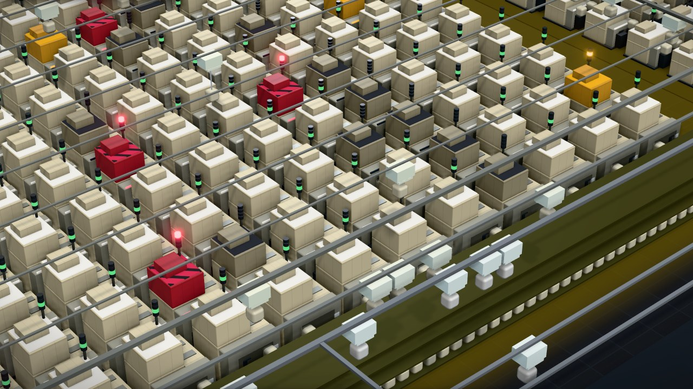</td>
<td width="50%">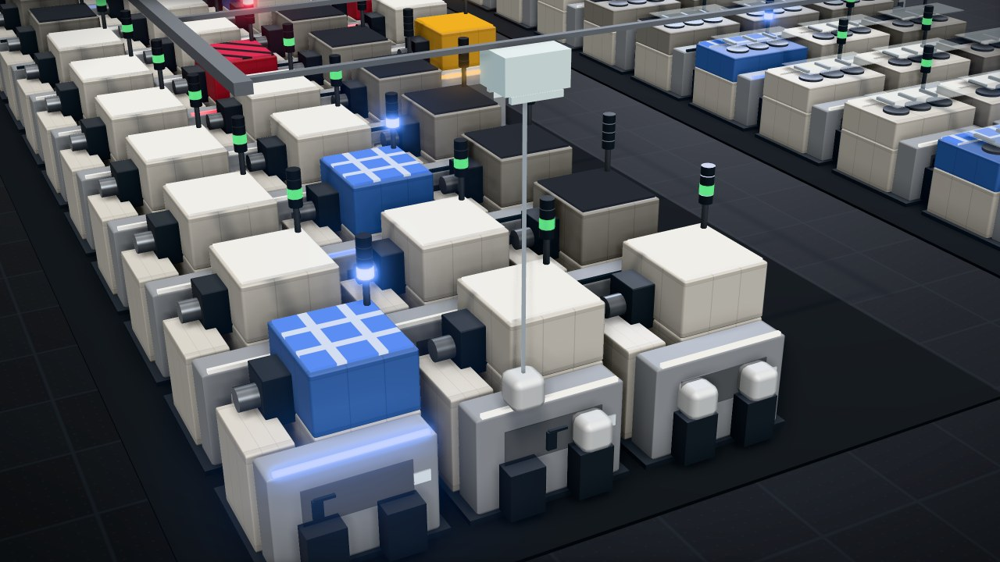</td>
</tr>
<tr>
<td align="center">Màu trạng thái lấy đúng từ kernel: đỏ sọc đen = hỏng, vàng = setup, nóc trắng = bận</td>
<td align="center">Xe OHT và FOUP là lớp minh hoạ dựng lại từ replay</td>
</tr>
</table>

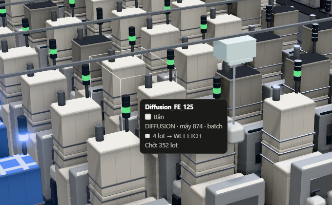

Rê chuột vào máy: số lot đang ở máy và khu mà lot mới nhất sẽ đi tiếp

**Điểm cần biết:**
- Chỉ lớp trạng thái máy được test so với kernel theo từng thời điểm, ở 3 giá trị rảnh / bận / hỏng (xem
  D6); phần tách riêng setup, PM theo wafer, PM định kỳ không được so với kernel. Mẫu chỉ được test ở mẫu
  cuối (xong, CQT, WIP). Số trên kệ và các ô xong / WIP / CQT của HUD là nội suy giữa hai mẫu 15 phút
  (mẫu lấy ở lần dispatch đầu tiên sau mỗi mốc).
- FOUP nằm trên cổng nạp từ lúc máy bắt đầu tới `lot_end`, tức gồm cả thời gian vận chuyển kernel đã cộng.
  Cổng chọn theo thứ tự dispatch chẵn / lẻ; batch từ 2 lot chiếm cả hai cổng.
- Xe OHT là minh hoạ: chuyến kệ → cổng, cổng → khu kế (stocker, cổng XONG), cổng VÀO → khu đầu; một batch
  là một FOUP; thời gian chuyến co giãn theo tốc độ phát; số chuyến vẽ ra có trần theo mức chất lượng
  (90% của 360 / 240 / 120). Cùng một lot có thể vừa được chở đi vừa được chở tới.
- Đèn máy hỏng nhấp nháy, đèn máy bảo trì "thở" chỉ khi đang phát. Chưa mở replay thì máy màu trắng, đèn
  tắt.

Mã nguồn: [app.js#L350-L393](../fabframe/ui/static/app.js#L350-L393),
[fab3d.js#L320-L372](../fabframe/ui/static/fab3d.js#L320-L372),
[fab3d.js#L176-L205](../fabframe/ui/static/fab3d.js#L176-L205),
[fab3d.js#L1115-L1127](../fabframe/ui/static/fab3d.js#L1115-L1127),
[fab3d.js#L1434-L1473](../fabframe/ui/static/fab3d.js#L1434-L1473),
[fab3d.js#L1475-L1566](../fabframe/ui/static/fab3d.js#L1475-L1566),
[fab3d.js#L1772-L1852](../fabframe/ui/static/fab3d.js#L1772-L1852)

### D6. Tua và phát

Các nút tua và phát đổi thời gian replay T thế nào, và vì sao tua lùi hay nhảy cóc vẫn cho đúng trạng
thái như khi phát tiến?

```mermaid
flowchart TD
    subgraph CTRL["Điều khiển (app.js)"]
        PLAY["▶ / ⏸, phím Space"]
        SPEED["Tốc độ ×1 … 1 ngày/s,<br/>↑ ↓ nhân / chia 2,<br/>chiều tiến / lùi"]
        JUMP["± 1 giờ: ← → ◀◀ ▶▶<br/>Shift: ± 1 ngày<br/>Home, End, kéo thanh"]
    end
    PLAY --> FRAME["frame() mỗi khung hình:<br/>T += min(dt, 0,1 s)<br/>× tốc độ × chiều × 10<br/>(T tính bằng decisecond,<br/>dừng ở 0 hoặc cuối)"]
    SPEED --> FRAME
    JUMP --> SEEK["seek(T)"]
    FRAME --> SET["scene.setTime(T)"]
    SEEK --> SET
    SET --> Q{{"Mỗi máy: lần đầu,<br/>T < lastT, hoặc<br/>con trỏ vượt T?"}}
    Q -- "có (tua lùi, lần đầu)" --> BIN["Tìm nhị phân: dispatch<br/>cuối có t ≤ T (đoạn<br/>hỏng / PM cũng vậy)"]
    Q -- "không (phát, nhảy tới)" --> STEP["Con trỏ tiến từng<br/>dispatch tới T"]
    BIN --> MS["machineState(m, T):<br/>chỉ phụ thuộc T"]
    STEP --> MS
    MS -.-> TEST["test_replay.py: tiến,<br/>lùi, zigzag giống hệt,<br/>lệch kernel ≤ 0,1%"]
```

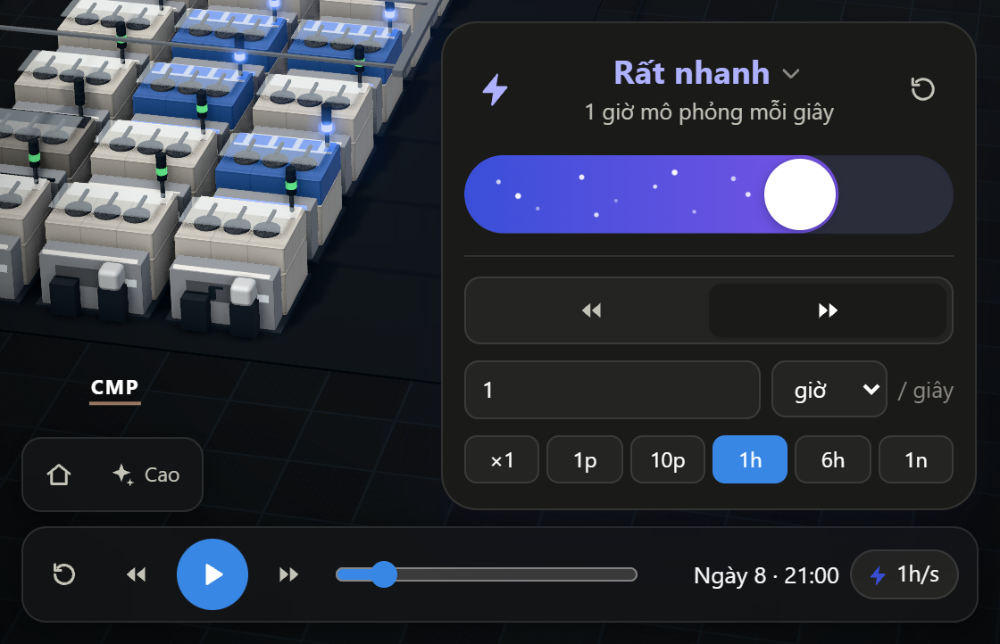

Thẻ tốc độ: tên mức, tốc độ chính xác, thanh trượt ×1 … 1 ngày/giây

**Điểm cần biết:**
- Tốc độ là giây mô phỏng mỗi giây thật, chia 6 mức: Thời gian thực (dưới 2), Chậm, Vừa (từ 60), Nhanh
  (từ 600), Rất nhanh (từ 3 600), Siêu tốc (từ 21 600). Mặc định 1 800 (30 phút mỗi giây). Tốc độ được
  nhớ trong trình duyệt, chiều phát thì không: replay mới mở luôn phát tiến.
- Trạng thái máy, FOUP trên cổng, kệ và HUD chỉ phụ thuộc T. Xe OHT còn phụ thuộc tốc độ phát, mức chất
  lượng và các khung hình trước, nên đổi tốc độ khi đang dừng cũng làm xe đổi chỗ.
- Test chạy luật CR trên HVLM, seed 4 (một ca từ đầu 2 ngày, một ca sau warm-up 0,6 + 1 ngày); zigzag là
  nhảy tới T + 10 h, lùi về T − 1 h, ba bước 1 phút rồi tới T. Test so 3 giá trị: rảnh / bận (gồm setup và
  bảo trì theo wafer) / hỏng (gồm bảo trì định kỳ).
- Địa chỉ `#t=2.5` mở replay đầu tiên tại mốc 2,5 ngày và dừng; `#t=2.5&play` thì phát luôn; `#bay=Litho`
  phóng vào một khu. Replay mở sau đó bắt đầu từ 0; đổi hash thì áp lại.

Mã nguồn: [app.js#L157-L189](../fabframe/ui/static/app.js#L157-L189),
[app.js#L191-L298](../fabframe/ui/static/app.js#L191-L298),
[fab3d.js#L1419-L1450](../fabframe/ui/static/fab3d.js#L1419-L1450),
[test_replay.py#L80-L99](../tests/test_replay.py#L80-L99),
[replay_states.mjs#L16-L64](../tests/replay_states.mjs#L16-L64)

## Bản draw.io (chỉnh sửa được)

Hai trang của [`luong-he-thong.drawio`](luong-he-thong.drawio): mở bằng extension draw.io trong VS Code
hoặc tại [app.diagrams.net](https://app.diagrams.net) để sửa. Ảnh dưới đây được xuất từ chính file đó.

**Trang 1 — Tổng quan hệ thống**

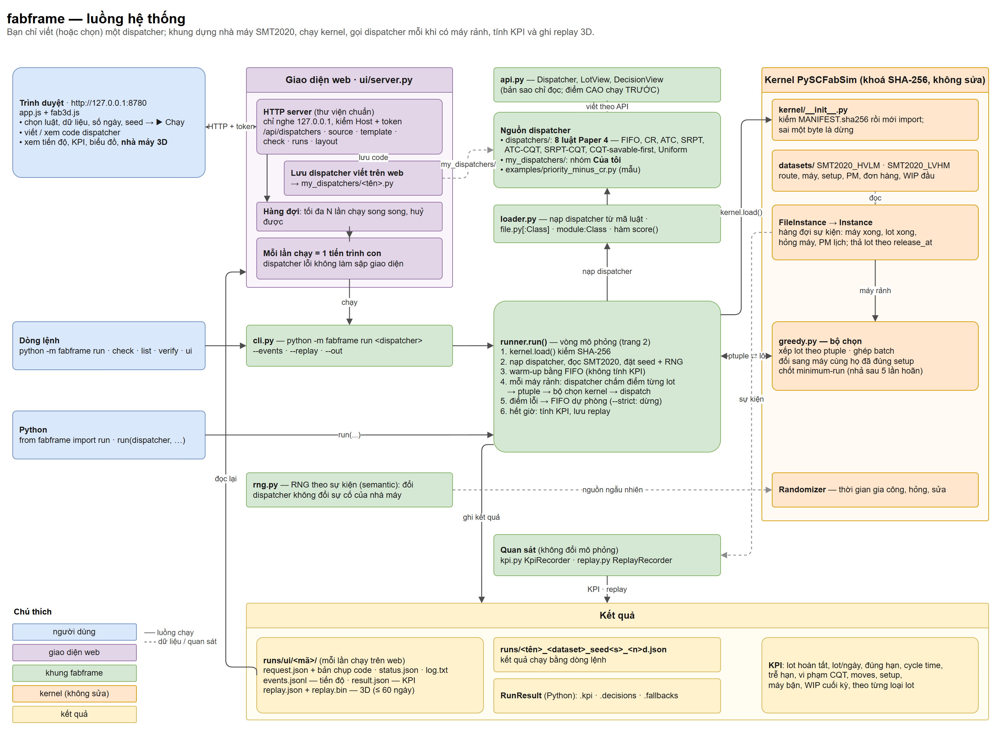

**Trang 2 — Một quyết định dispatch**

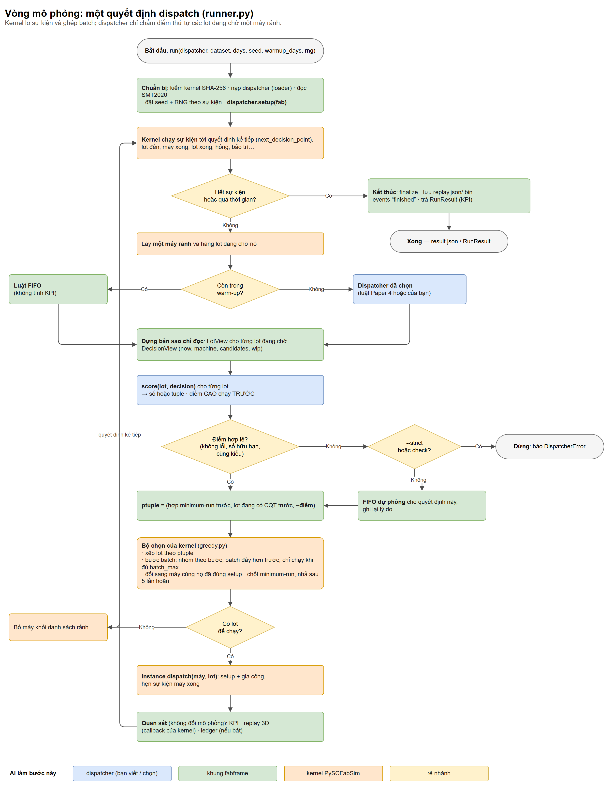
